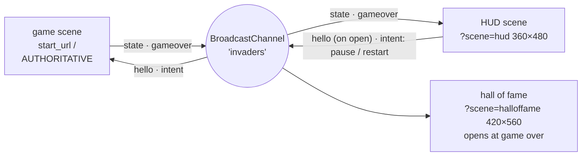

# L4 · Depth as gameplay: Space Invaders in space, with a second window

**Time:** 30 min in the room · 2.5 h self-paced
**Lab:** [`labs/p4-space-invaders`](../labs/p4-space-invaders/README.md). `start/` is the flat game; `solution/` is the spatial version. `start/` is exactly `solution/` with every line marked `SPATIAL` removed, so **`git diff --no-index start/src solution/src` is the whole lesson (plain `diff` doesn't exist in Windows PowerShell).**

**Official examples for this level (read, don't run):** [widget-generator](https://github.com/webspatial/widget-generator) (clock, weather and whiteboard widgets as separate scenes; SDK 1.0 + vite-plugin, MIT). Lab p4 is the **2.0** multi-window reference; the official 2.0 fixtures register no scenes. All examples, with SDK versions and licenses: [`examples/README.md`](../examples/README.md).

## The concept

So far depth has been decoration: a card floats forward because it looks nice. In this level **depth carries meaning**. You take a flat Space Invaders game and let Z tell part of the story:

- The game sits in the app's **glass window**, and every layer floats in front of it.
- Each **row** of invaders sits at its own depth, 30px apart, with the back row deepest.
- As the formation **descends** it also **comes toward you**: its depth is tied to its Y position, so the threat gets physically closer.
- **Shields** hang between the invaders and you. Your **ship** is always closest.
- **Your shots fly back into the formation's depth; enemy shots fly out toward you.**
- A **hit makes its row flinch forward** for a moment.
- A **HUD** (score, lives, wave) lives in a **second window**, and a **hall of fame** window opens at game over. They're all kept in sync over one channel.

```
 side view: window glass on the left, you on the right. Numbers are ABSOLUTE --xr-back in px.
 Every plane is top-level; the "formation" is just a number (5 + y·0.08) added to each row.

 window glass (0)                                                                  you
    │  formation depth: 5 + y·0.08   (y = 80 at the start of wave 1 → 11.4)       👁
    │   row 0 ▭▭▭▭▭▭▭▭▭▭▭  11.4 + 0  = 11.4   (top row, deepest)
    │     row 1 ▭▭▭▭▭▭▭▭▭▭▭  11.4 + 20 = 31.4
    │       row 2 ▭▭▭▭▭▭▭▭▭▭▭  11.4 + 40 = 51.4
    │         row 3 ▭▭▭▭▭▭▭▭▭▭▭  11.4 + 60 = 71.4
    │           row 4 ▭▭▭▭▭▭▭▭▭▭▭  11.4 + 80 = 91.4
    │    all five rows slide → as the formation descends; a hit row flinches +24
    │                                   ▀▀ ▀▀ ▀▀ ▀▀  shields 100
    │            • your shot: 120 → back to the target row      ◦ enemy shot: row → 120
    │                                                    ▲ ship 120 (closest; the deepest front row ever reaches is 118)
    │  ◀ Fire ▶ buttons flat (0)              Ready / Paused / Game over card 150
```

### The key lesson: one spatial layer per row, not per sprite

Every `enable-xr` element becomes a **separate native plane** that the OS composites, positions and hit-tests. Fifty-five invaders plus every shield block as spatial elements is **230+ planes** to create and update. This game uses **14**.

So the rule is: **spatialize the container, not the sprite.** A row is one `enable-xr` element, and the invaders inside it are ordinary `<div>`s that ride on the row's plane (per the docs, children of a lifted spatialized element move with it). All four shield bunkers share one plane. You spend your **layer budget** only where depth actually differs.

**Don't nest `enable-xr` inside `enable-xr`.** On PICO OS 6.0.0 (web-app runtime 0.4.0), a spatial element inside another spatial element never rendered: the first version of this lab (spatial playfield > spatial formation > spatial rows) created only the top-level planes, and all 16 nested ones stayed empty 0×0 documents (VERIFIED 2026-09-24 through the installed app's DevTools socket). So compute each layer's **absolute** depth yourself and keep every spatial element top-level.


| Layer | Planes | Depth (`--xr-back`, px) | Why it's a plane |
|---|---|---|---|
| Playfield | 0 | a plain div in the glass window | a spatial parent would hide every spatial child (see above) |
| Rows 0 to 4 | 5 | **absolute**: `5 + y × 0.08` (the formation depth, **comes forward as it descends**) `+ row × 20` (0 / 20 / 40 / 60 / 80, back rows deepest) `+` a **24** flinch on a hit | rows differ in depth, move together, flinch on their own |
| Invaders | 0 | ride on their row | same depth as the row, so a plane each buys nothing |
| Shields | 1 | 100, all four bunkers on one plane | one depth for the whole line; blocks are plain divs |
| Ship | 1 | 120, always the closest (the front row tops out at `5 + 412 × 0.08 + 80 = 118`) | |
| Player shots | 2 (pooled) | from 120 **back** to the front row's depth as they rise | travel in Z |
| Enemy shots | 2 (pooled) | from the firing row's depth **toward you** to 120 | travel in Z |
| UFO | 0 | on the page plane: far away | cosmetic |
| ◀ Fire ▶ buttons | 0 | flat, in the page | plain `onClick` buttons; lifting them pushed them below the window edge |
| Overlay card | +1 while shown | 150 | Ready / Paused / Game over must sit in front of the rows |

**11 planes while playing, 12 while the overlay shows.** The docs publish no per-scene plane limit, so treat "about 15" as a budgeting habit, not a hard number.

**Keep depths modest:** a plane lifted far toward you, low in the window, projects below the window's bottom edge in the default view. At `SHIP_Z` 260 the ship vanished on PICO OS 6.0.0, so the lab now keeps every layer inside the window's footprint (VERIFIED 2026-09-24). *(UNVERIFIED: what PICO OS 6 sustains at frame rate. Measure it with `pico-cli perf` in L5.)*

### And more windows

The **HUD** and the **hall of fame** are their own **scenes**: separate documents, separate React trees, no shared memory. The game window owns the state and broadcasts it; the other scenes display it and send **intents** back.



## What it looks like


*Spatial Invaders as a web app, at Ready (badge: "Web app · WebSpatial on"), in front of the flat tab it was installed from. The shields and the ◀ Fire ▶ buttons stand forward of the glass and overhang its bottom edge. (This capture is from the earlier, deeper tuning; the lab now uses smaller depths and flat buttons.)*


*Mid-game: score 20, one invader gone from row 2, a player shot and an enemy shot in flight. Each row is one plane.*

*Emulator screenshots, PICO OS 6.0.0 emulator, 2026-09-24. The PICO Emulator is PICO-licensed; this workshop's attendees are cleared by PICO. Check with PICO before publishing OS screenshots outside the workshop.*

## The lab, step by step

The sections below follow the lab README's steps. All of the depth logic lives in `src/depth.ts`. Every spatial line in `Game.tsx` and `app.css` is marked `SPATIAL`.

### Step 1 · Wire WebSpatial

These are the same four pieces as p1 and p2:
- SDK 2.0.0
- `jsxImportSource` in `tsconfig.json` **and** in `react({ jsxImportSource: '@webspatial/react-sdk' })`
- `<SpatialBoot>` in `main.tsx`
- `public/app.webmanifest`, linked from `index.html`

The manifest sizes the game window, because it's the start scene:

```json
{
  "name": "Spatial Invaders",
  "short_name": "Invaders",
  "start_url": "/",
  "scope": "/",
  "display": "minimal-ui",
  "icons": [ … 192, 512, 1024 any, 1024 maskable … ],
  "xr_main_scene": { "default_size": { "width": 900, "height": 1000 }, "resizability": { … } }
}
```

### Step 2 · Rows get depth

The depth model is one file:

```ts
// src/depth.ts: every Z decision in the game. Values are --xr-back in px, measured from the
// WINDOW's plane. No spatial element is nested inside another one (nested ones never rendered
// on PICO OS 6.0.0), so every depth here is absolute.
// Kept small on purpose: a plane lifted far toward you, low in the window, projects below the
// window's bottom edge in the default view (at SHIP_Z 260 the ship vanished on PICO OS 6.0.0).
// The deepest possible front row is 5 + 412 * 0.08 + 80 = 118 < 120, so the ship stays closest.
export const BASE = 5           // formation depth at the top of the playfield
export const APPROACH = 0.08    // px of depth gained per px of descent: z is tied to y
export const ROW_STEP = 20      // row 0 (top, back) at 0, then 20, 40, 60, 80 in front of the formation
export const SHIELD_Z = 100     // shields float between the formation and you
export const SHIP_Z = 120       // the ship is always the closest thing
export const OVERLAY_Z = 150    // ready / paused / game over card, in front of everything
export const POP = 24           // how far a hit row flinches toward you
export const POP_DECAY = 0.85   // per frame at 60 fps: back to rest in about 200 ms

export const formationZ = (y: number) => BASE + y * APPROACH
/** A row's offset in front of the formation's depth: back row 0, front row 80. */
export const rowZ = (row: number, pop = 0) => row * ROW_STEP + pop
/** A row's absolute depth: what its --xr-back is set to, and where a shot aimed at it arrives. */
export const rowWorldZ = (formationY: number, row: number, pop = 0) => formationZ(formationY) + rowZ(row, pop)
```

The markup keeps **every spatial element top-level**. The playfield is a plain div, there is no formation element, and the five rows are siblings. Invaders stay plain divs inside their row:

```tsx
{/* The playfield stays a plain div: a nested enable-xr never rendered on PICO OS 6.0.0. */}
<div className="playfield" style={{ width: C.W, height: C.H }}>
  <div ref={ufoRef} className="ufo" />
  {w.alive.map((row, r) => (
    <div enable-xr key={r} ref={(el) => { rowRefs.current[r] = el }} className="row" style={{ width: C.FORMATION_W }}>
      {row.map((alive, c) => <div key={c} className={`invader kind-${r} …`} style={{ left: c * C.CELL_X }} />)}
    </div>
  ))}
  <div enable-xr ref={shieldsRef} className="shields" …>{/* four bunkers of plain block divs */}</div>
  <div enable-xr ref={shipRef} className="ship" />
  {/* 2 pooled shots + 2 pooled bombs + 3 buttons, each enable-xr, all top-level */}
</div>
```

The docs describe nested `--xr-back` as measured from the nearest spatialized ancestor, so on paper nesting would add the depths for you. On PICO OS 6.0.0 nested elements never rendered, so the lab adds them itself (`formationZ(y) + rowZ(r)`).

Every moving layer is already `position: absolute` in `app.css`, which `--xr-back` requires. The value is **px only**, keeps one decimal, and must be **non-negative**. The window glass is the back wall.

### Step 3 · Depth tied to descent

Spatialized elements **don't support CSS animations or transitions yet**, so every depth is written from the `requestAnimationFrame` loop, through refs, by one helper that skips unchanged values:

```ts
// depth.ts
const last = new WeakMap<HTMLElement, number>()
export function writeBack(el: HTMLElement | null, z: number) {
  if (!el) return
  const v = Math.round(Math.max(0, z) * 10) / 10   // px, one decimal, never negative
  if (last.get(el) === v) return                    // unchanged writes still cost a bridge update
  last.set(el, v)
  el.style['--xr-back'] = String(v)                 // the documented imperative form; the SDK types it
}

// Game.tsx, draw()
// The formation is five rows moving together.
for (let r = 0; r < C.ROWS; r++) {
  place(rowRefs.current[r], w.fx, w.fy + r * C.ROW_H)                     // X/Y via transform: translate(...)
  // SPATIAL: absolute depth = formation (grows as it descends) + one step per row + its flinch
  writeBack(rowRefs.current[r], formationZ(w.fy) + rowZ(r, w.pops[r]))
}

// once: the fixed depths
writeBack(shipRef.current, SHIP_Z); writeBack(shieldsRef.current, SHIELD_Z)
```

Reach elements through refs, never `document.querySelector`: spatial styles only work on elements React rendered.

### Step 4 · Shots travel in Z; hits flinch

```ts
// your shot: recedes from the ship's plane to the front-most live row as it rises
writeBack(el, lerp(SHIP_Z, rowWorldZ(w.fy, target, w.pops[target]),
                   (C.SHIP_Y - s.y) / (C.SHIP_Y - (w.fy + target * C.ROW_H))))

// enemy shot: comes at you, from the firing row's depth (b.z0 = rowWorldZ(w.fy, r)) to the ship's
writeBack(el, lerp(b.z0, SHIP_Z, (b.y - (w.fy + C.ROWS * C.ROW_H)) / (C.SHIP_Y - (w.fy + C.ROWS * C.ROW_H))))

// a hit: the row flinches toward you, then decays frame-rate independently
w.pops[r] = POP
w.pops.forEach((p, r) => (w.pops[r] = p < 0.1 ? 0 : p * Math.pow(POP_DECAY, dt * 60)))
```

`lerp` clamps `t` to 0..1. Collision never reads Z, so the game plays identically on a laptop.

**Pressable buttons in the headset.** The ◀ Fire ▶ buttons are now **flat** (no `enable-xr`) with plain **`onClick`**: lifted, they projected below the window edge. A pinch on a button arrives as a click. Don't add `onSpatialTap` to a `<button>`. Even gated behind `useSpatialReady()`, it made React log `Unknown event handler property onSpatialTap` as a console error inside the PICO runtime (VERIFIED 2026-09-24 in the installed p4 app). Keep spatial events (`onSpatialTap` and friends) for `<Model>`, `<Reality>` entities and `enable-xr` **divs**; never put them on a `<button>`.

### Step 5 · The HUD window

```ts
// src/scenes.ts: the type is the THIRD argument
export function registerScenes() {
  initScene('hud', (prev) => ({ ...prev, defaultSize: { width: 360, height: 480 }, resizability: { minWidth: 300, minHeight: 380 } }), { type: 'window' })
  initScene('halloffame', (prev) => ({ ...prev, defaultSize: { width: 420, height: 560 } }), { type: 'window' })
}

export function openScene(name: 'hud' | 'halloffame') {
  window.open(`${import.meta.env.BASE_URL}?scene=${name}`, name)   // 2nd arg MUST equal the initScene name
}
```

`main.tsx` routes `?scene=hud` and `?scene=halloffame` to their components, and everything else to the game, all inside `<SpatialBoot onReady={registerScenes}>`. **`registerScenes` runs in `onReady`, not at module load**: in SDK 2.0's lazy entry, `initScene` is a silent no-op until boot finishes (VERIFIED in the emulator on p3, 2026-09-24; see [L2](L2.md#5-a-second-window)). The bus (`src/bus.ts`, channel **`'invaders'`**):

```ts
type Msg =
  | { type: 'hello' }
  | { type: 'state'; state: HudState }                 // score, lives, wave, status
  | { type: 'gameover'; score: number; wave: number }
  | { type: 'intent'; action: 'pause' | 'restart' }

// game (authoritative): answer hellos, apply intents, broadcast HUD state on change, never per frame
if (msg.type === 'hello') bus.post({ type: 'state', state: world.current.hud })
if (msg.type === 'intent') msg.action === 'pause' ? togglePause() : restart()
useEffect(() => { busRef.current?.post({ type: 'state', state: hud }) }, [hud])
```

The HUD sends `hello` when it mounts, so a HUD opened mid-game (or reopened) shows the live score immediately.

**Keep the HUD flat on its own glass.** Don't wrap the HUD page in `enable-xr`: a single `<main enable-xr>` HUD came up blank on PICO OS 6.0.0, because the window is already glass. Keep any floating panels there small and few. Also observed: the HUD opened at the main window's size in the main window's slot, not the requested 360×480. That's OS placement, not something the page controls.

### Step 6 · Gotcha: a message posted just before `window.open` can vanish

At game over, the game tells the already-open HUD, then opens the hall of fame. The obvious code loses the message:

```ts
bus.post({ type: 'gameover', score, wave })
openScene('halloffame')                          // same task: the HUD never hears 'gameover'
```

In Chrome, a `BroadcastChannel` message posted in the **same task** that opens a brand-new window is **dropped for the windows already listening**. The lab's automated check reproduces it: the HUD never shows "Game over". The fix is to open the new window on a later task:

```ts
bus.post({ type: 'gameover', score, wave })
window.setTimeout(() => openScene('halloffame'), 100)
```

*(VERIFIED in desktop Chrome, 2026-09-24, SDK 2.0.0, reproduced in this lab. Not yet measured inside PICO's Web App Runtime; keep the deferral either way.)*

### Step 7 · In the emulator

```powershell
node setup/launch.mjs 4 --serve              # from the kit root: starts start/ (5304) and opens it in the emulator
node setup/launch.mjs 4 --serve --solution   # the finished game (5314)
```

Under the hood: `cd labs/p4-space-invaders/start`, then `npm run dev:xr`, then `adb reverse` + `http://localhost:<port>/` in the PICO Browser.

Then install it: click the **monitor icon, titled Install app on OS 6.0.0** (PICO's docs call it "Open as standalone app"), then **Install**, and wait up to 60 s; if panels are still missing, close and reopen the app once. The lab's **runtime badge** says which mode you're in: "Browser tab · flat" or "Web app · WebSpatial on". `10.0.2.2` loads but was not a secure context in our test (no install), so use `localhost` (VERIFIED 2026-09-24). Start a game, open the HUD, and place it beside the game.

**Glass still empty after 60 s?** Close and reopen the app once. On a cold launch the runtime can answer slower than the SDK's 30 s request timeout; the console shows `Uncaught (in promise) Error: createSpatialized2DElement failed`, and the SDK doesn't retry. A reload of the same app creates every element. The lab solutions reload themselves once for this (`src/spatialRetry.ts`) (VERIFIED 2026-09-24).

**Can't see the ship?** A plane lifted far toward you, low in the window, projects below the window's bottom edge in the default view. At `SHIP_Z` 260 it vanished, which is why the lab now uses 120. Look down, or lower `SHIP_Z` further.

## Common mistakes

- **Wrapping a second window's whole page in `enable-xr`.** On PICO OS 6.0.0 it came up blank (p4's HUD as one `<main enable-xr>`, p2's per-row schedule layers). In a second window, don't wrap the page in `enable-xr`; the window is already glass. Keep floating panels small and few (a large one intermittently fails to create on PICO OS 6.0.0). Observed OS behavior (PICO OS 6.0.0, 2026-09-24): second windows opened at the main window's size, in the main window's slot, regardless of the requested `defaultSize` (520×640 and 360×480 in the labs). The page doesn't control this.
- **Lifting layers too far.** A plane lifted far toward you, low in the window, projects below the window's bottom edge in the default view (the ship vanished at 260). Keep depths modest.
- **`enable-xr` on every invader or shield block.** It works, and it's the wrong design: hundreds of native planes. Spatialize rows and the shield line.
- **Nesting `enable-xr` inside `enable-xr`** (a spatial playfield or formation around spatial rows). On PICO OS 6.0.0 the nested elements never rendered: empty 0×0 documents. Keep spatial elements top-level and compute absolute depths.
- **CSS `transition` or `@keyframes` for the flinch.** Not supported on spatialized elements. Animate from the game loop.
- **`document.querySelector('.row').style…`** in the loop. Spatial styles only work through React-rendered elements (JSX or refs).
- **Writing depth every frame even when it didn't change.** Round to one decimal and skip equal writes (`writeBack`).
- **Negative `--xr-back`** to push something "behind" the glass. Not a documented range. The playfield plane is the back wall.
- **Creating a spatial element per shot.** Pool them (the lab uses 2 shots and 2 bombs).
- **`onSpatialTap` on a `<button>`.** React logs `Unknown event handler property onSpatialTap`, even inside the PICO runtime and even when gated by `useSpatialReady()`. Use `onClick`: a pinch on a spatial button arrives as a click.
- **Posting on the channel and calling `window.open` in the same task.** Chrome drops the message for the windows already open. Defer the open with `setTimeout(…, 100)`.
- **Broadcasting the whole game state at 60 Hz.** Send HUD-level state when it changes.
- **Name mismatch** between `initScene('hud', …)` and `window.open(url, 'HUD')`: the config is silently not applied.
- **`registerScenes()` at the top of `main.tsx`.** Before boot, `initScene` is a no-op and the HUD opens at the default size. Use `<SpatialBoot onReady={registerScenes}>`.
- **Sizing the game window with `initScene`.** It's the start scene: only `xr_main_scene` in the manifest is read in time.
- **camelCase in the manifest** (`defaultSize`, `minWidth`). Manifest keys are snake_case (`default_size`, `min_width`).

## Claude Code prompts for this level

Start with the one that teaches the most:

```text
Run git diff --no-index labs/p4-space-invaders/start/src labs/p4-space-invaders/solution/src (works in PowerShell and bash) and walk me
through every SPATIAL change in order: which elements became planes, what depth each gets
from src/depth.ts, and why the invaders and shield blocks did not.
```

Then build it yourself in `start/`, one step at a time:

```text
Step 2: Make each .row, the shields line, the ship, the pooled shots and bombs and the 3 buttons
enable-xr, all top-level (no spatial parent: leave the playfield a plain div), and leave every invader and shield block a plain div. Put the depth
constants from the depth map in a new src/depth.ts (ROW_STEP = 20, row 0 deepest). Then count
the enable-xr elements and tell me the number (expect 11 while playing).
```

```text
Step 3: Tie the formation's depth to its descent (5 + y * 0.08), set each row's ABSOLUTE depth to
formationZ(y) + row * 20 + flinch, and write every depth from the requestAnimationFrame loop through refs with a writeBack helper that rounds to one decimal,
clamps at 0 and skips unchanged values. No CSS transitions on spatial elements.
```

```text
Step 4: Make player shots recede from SHIP_Z (120) to the front-most live row's absolute depth,
enemy shots come from their row's depth to 120, and a hit row flinch by POP (24) with
POP_DECAY 0.85 per 60 fps frame. Keep collisions 2D. Keep the on-screen buttons on plain
onClick (no onSpatialTap on a <button>).
```

```text
Step 5: Add 'hud' (360x480) and 'halloffame' (420x560) scenes with initScene(..., { type:
'window' }) in a registerScenes() called from <SpatialBoot onReady={registerScenes}>, open them with window.open(url, name), and sync over a BroadcastChannel named
'invaders': the game is authoritative, answers hello, applies pause/restart intents, and
broadcasts HUD state only when it changes. Prove in desktop Chrome that a HUD opened mid-game
shows the live score.
```

```text
Step 6: At game over, post 'gameover' and open the hall of fame. Show me that opening it in the
same task makes the HUD miss 'gameover', then fix it with setTimeout(() =>
openScene('halloffame'), 100) and prove the HUD now shows Game over.
```

```text
Step 7: Launch the game in the PICO emulator with node setup/launch.mjs 4 --serve, install it as a web
app, open the HUD, take a burst of screenshots with node setup/snap.mjs, then close the HUD and
reopen it. Tell me whether it showed the right score immediately after reopening.
```

## Check your understanding

1. **Why is each row a plane, but not each invader?**
   Every spatialized element is a separate native plane. Invaders in a row share one depth, so one plane per row gives the same picture for a fraction of the layer budget: 11 planes instead of 230+.
2. **At the start of wave 1 the formation is at `y = 80` (`START_Y`). What `--xr-back` does row 4 (the front row) get, and why don't you nest it in a spatial formation element?**
   91.4px, computed by the game: `5 + 80 × 0.08 = 11.4` for the formation, plus `4 × 20 = 80` for the row. On paper a nested spatial element would measure from its spatial parent, but on PICO OS 6.0.0 nested spatial elements never rendered, so every plane is top-level and gets its absolute depth.
3. **Why can't the flinch be a CSS transition?**
   Spatialized elements don't support CSS animations or transitions yet. Depth has to be written from JS (the game loop, through a ref).
4. **The hall of fame opens at game over, but the HUD never shows "Game over". Why?**
   `gameover` was posted in the same task as `window.open` for the new window, and Chrome dropped it for the already-open HUD. Open the new window on a later task: `setTimeout(() => openScene('halloffame'), 100)`.
5. **Why does the game window's size come from the manifest and not `initScene`?**
   It's the start scene: the OS creates it from `start_url` before any of your code runs, so only `xr_main_scene` is read in time.

## Next

Do the lab: [`labs/p4-space-invaders/README.md`](../labs/p4-space-invaders/README.md). You're done when:
- rows sit at visibly stepped depths in the emulator (formation depth + 0 / 20 / 40 / 60 / 80; front rows look larger),
- the formation comes forward as it descends,
- a hit makes its row flinch,
- the HUD shows the live score after a close and reopen, and shows "Game over" when the hall of fame opens,
- and you can state the plane count (11, or 12 with the overlay), say why invaders aren't planes, and say why nothing is nested.

Then go to [L5](L5.md), where you measure that layer budget with `pico-cli perf`.

---
*Sources: `labs/p4-space-invaders/solution/src/{depth,Game,scenes,bus}.ts(x)`, `app.css`, and README (final, desktop e2e 14/14, 2026-09-24; the Step 6 gotcha reproduced in this lab); webspatial.dev `back` (inset semantics, position requirement, px-only, one decimal, children follow a lifted parent, not CSS-animatable, the `ref.current.style["--xr-back"]` form), JSX Markers, Getting Started "philosophy" (declarative / ref-only spatial styles), Spatial Scenes concept, `initScene`, `main_scene` manifest schema (fetched 2026-09-24); `@webspatial/react-sdk@2.0.0` `initScene` signature (`options?: { type }`); `labs/SPATIAL-CRACK.md` (install path). `labs/EMULATOR-RESULTS.md` "labs-builder fix loop" (the game VERIFIED as an installed web app on PICO OS 6.0.0: rows stepped, shots fly, hits land, `transform: translate()` moves spatial planes; nested `enable-xr` never rendered; cold-launch timeout). **Unverified:** frame rate with per-frame `--xr-back` writes, BroadcastChannel between PICO scenes and the Step 6 gotcha inside PICO; the per-scene plane budget PICO OS 6 sustains; negative `--xr-back` behaviour.*
