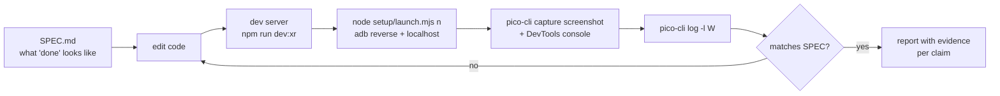
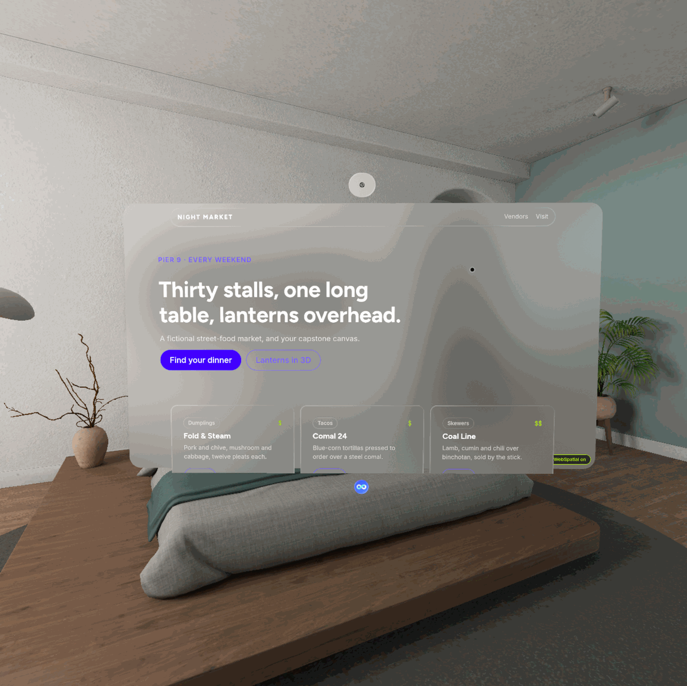

# L5 · Expert and agentic: Claude Code runs the loop, performance, shipping

**Time:** 25 min in the room (15 demo + 10 capstone kickoff) · 4 h self-paced
**Capstone:** [`labs/p5-capstone`](../labs/p5-capstone/README.md): spatialize **your** site

**Official examples for this level:** [`examples/webspatial-vite-min/`](../examples/webspatial-vite-min/): [`xr-monitor.html`](../examples/webspatial-vite-min/xr-monitor.html) (`enable-xr-monitor`, booted with `bootSpatial()`) and [`eager-lean.html`](../examples/webspatial-vite-min/eager-lean.html) (the `@webspatial/react-sdk/eager` entry, no boot step: compare with the lazy index page). Plus the SDK 2.0 fixtures, all MIT: [`apps/spatial-next-min`](https://github.com/webspatial/webspatial-sdk/tree/main/apps/spatial-next-min) (Next.js), [`apps/spatial-remix-min`](https://github.com/webspatial/webspatial-sdk/tree/main/apps/spatial-remix-min) (React Router 7), [`apps/spatial-rspack-min`](https://github.com/webspatial/webspatial-sdk/tree/main/apps/spatial-rspack-min) (Rspack) and [`apps/test-server`](https://github.com/webspatial/webspatial-sdk/tree/main/apps/test-server) (per-API test pages). Clone with `git clone -c core.longpaths=true https://github.com/webspatial/webspatial-sdk`. All examples, with SDK versions and licenses: [`examples/README.md`](../examples/README.md).

## The concept

By now you've done every step by hand: edit, serve, open in the emulator, look, read logs, fix. Each of those steps is a command, so an agent can run them. The expert move is **handing Claude Code the whole loop and holding it to evidence**:



Two rules keep the loop honest:

1. **Every "it works" needs a piece of evidence you can open:** a screenshot path, a log line, or a DevTools read. "The code looks right" isn't evidence.
2. **Bound the loop.** Give it an iteration cap and a stopping condition. An agent that keeps "fixing" a screenshot artefact can burn an hour. (The emulator's screenshots are sometimes partly black while the app renders fine. See [TROUBLESHOOTING](TROUBLESHOOTING.md).)

## What it looks like


*The capstone template running as a web app.*


*`window.open(url, '<scene name>')` inside the web app: a food stall opens as its own glass window, with its card lifted in front.*

*Emulator screenshots, PICO OS 6.0.0 emulator, 2026-09-24. The PICO Emulator is PICO-licensed; this workshop's attendees are cleared by PICO. Check with PICO before publishing OS screenshots outside the workshop.*

## The toolbelt

### PICO's agent layer (installed in L0)

`pico-cli setup --agent-tool claude-code --platform spatial` installs:

- **Plugin skills** Claude Code loads on demand. The ones that matter for web work are `pico-cli` (which command to run), `pico-env-doctor`, `spatial-emulator-usage`, and `spatial-app-performance-analysis`. Most other PICO skills (scene builder, SDK guideline, porting) are for **native** Kotlin Spatial SDK apps, not WebSpatial.
- **`pico-dev-knowledge` MCP**: a queryable graph of PICO's developer docs (`query_graph`). Ask it for PICO guidance instead of trusting the model's memory, and ask it to cite.

```bash
pico-cli plugin doctor       # are the skills installed and current?
pico-cli knowledge doctor    # is the knowledge base READY?
pico-cli knowledge pull      # update it
```

### WebSpatial's agent layer

```bash
npx @webspatial/starter ai   # in YOUR project, never inside labs/
```

What it writes (**VERIFIED 2026-09-24**, `@webspatial/starter` v0.1.0 of 2026-04-15, run on a scratch copy of p1):
- `.webspatial/docs/` (54 files)
- `.claude/` plus a block appended to `CLAUDE.md`
- `.codex/skills`
- a block appended to `AGENTS.md`
- a `.git/info/exclude` entry

**Hazard: its docs predate SDK 2.0.** `<SpatialBoot>` appears nowhere in them, and the `CLAUDE.md` block it adds says *local `.webspatial/docs` always wins*. In a 2.0 project, that steers Claude Code away from `<SpatialBoot>`, which is exactly the mistake that leaves `enable-xr` silently inert (L1).

So:
- **Don't run it inside the Academy labs.** They're 2.0 projects, and the kit's own `CLAUDE.md` and `labs/VERSIONS.md` already give Claude the right rules.
- **In your own project**, run it, then add this line to your `CLAUDE.md` **right after its block**:

  ```text
  SDK 2.0: wrap the app in <SpatialBoot>; labs/VERSIONS.md overrides .webspatial/docs
  ```

  In your own repo, point that at your own pin notes if you don't have the labs folder. The rule to keep is "2.0 means `<SpatialBoot>`, and the version notes beat the bundled docs".

### Seeing inside a scene

The PICO OS 6 runtime is Android-based, so **Chrome DevTools remote debugging works**: open `chrome://inspect` on your laptop while the emulator is attached over adb, and each Web App scene shows up as an inspectable target. That's how you read `console.log` from a satellite scene, check `navigator.userAgent`, or confirm `<SpatialBoot>` fired `onReady`.

### Performance

```bash
pico-cli perf doctor                                    # install profiler deps once
pico-cli perf live run -t 20 --package <pkg>            # live FPS/CPU/GPU columns for 20 s
pico-cli perf trace record -t 10 --package <pkg> -o trace.perfetto-trace
pico-cli perf trace load trace.perfetto-trace           # prints a sessionId
pico-cli perf trace analysis frame.spatialOverview ...  # then frame.spatialjanks, frame.appSlowest, report.overview
```

`<pkg>` is the process your page runs in. On the emulator the PICO Browser is `com.picoxr.browser`. Whether a standalone Web App runs under that package or its own is **unverified**: check with `pico-cli app list` while it's open. Usual costs in a WebSpatial page: too many `enable-xr` elements (each is a native plane: this is where you measure L4's layer budget, for example per-row vs per-sprite Space Invaders), heavy GLBs, and JS animation loops that update styles every frame when nothing changed.

### Shipping

| Target | How |
|---|---|
| **PICO OS 6** | Deploy the site to an **HTTPS** URL. That URL is the distribution: people open it and install it as a Web App. To launch it as a Web App directly on a device you control: `pico-cli web launch --manifest-url https://your.site/app.webmanifest` (an HTTPS manifest URL is unaffected by its `localhost` rewrite; **it fails on the OS 6.0.0 emulator** with `INSTALL_FAILED_UID_CHANGED`, so there use the Install app icon) (the manifest must have `name` or `short_name`, `start_url`, `icons`). PICO store listing for Web Apps currently goes through PICO business partnerships, not self-serve. |
| **visionOS** | `npm i -D @webspatial/builder @webspatial/platform-visionos`, then `webspatial-builder run --base=<url>` on a Mac with Xcode; `build` and `publish` for devices and the App Store. |
| **Everyone else** | The same URL is a normal website. That's the point. |

## Common mistakes

- **Expecting the p5 "Lanterns in 3D" volume to fill on PICO OS 6.0.0.** Known issue: it opens empty and logcat shows `ModelComponent already exists`. The cause is sizing, not StrictMode: `<Reality style={{height:'100%'}}>` under an auto-height `#root` is 0 px tall. Fix: empty volume? give `<Reality>`/`<Model>` a real size (`100vw`/`100vh`, or give `html`/`body`/`#root` a height); a percentage of an auto-height parent is 0. Emulator re-test pending.
- **Trusting `npx @webspatial/starter ai` docs in a 2.0 project.** They predate 2.0 (no `<SpatialBoot>`) and claim precedence. Add the override line: `SDK 2.0: wrap the app in <SpatialBoot>; labs/VERSIONS.md overrides .webspatial/docs`.
- **Letting the agent claim success from code alone.** Require a screenshot path and a log excerpt for each claim.
- **One huge prompt, no cap.** Give it a spec file, an iteration limit, and "stop and show me".
- **Asking the model about PICO from memory.** Route it through `pico-dev-knowledge` and ask for the source.
- **Profiling the wrong process.** Confirm the package with `pico-cli app list` first.
- **Shipping over plain HTTP.** Fine for `localhost` via `adb reverse` in the emulator; real devices and installs expect HTTPS.
- **Running `pico-cli web launch` against a shared or lent headset.** It installs a browser APK first. Emulator only, unless you own the device.
- **Spatializing everything.** A spatial site with 60 floating elements is slower and harder to read than one with 6 good ones.

## Claude Code prompts for this level

```text
Run the whole loop on this repo without asking me: start the dev server, launch it in the
PICO emulator, screenshot every scene, read the last 200 log lines at warning or above, fix
anything broken, and repeat until the screenshots match SPEC.md. Stop after 5 iterations
either way and show me the evidence for each claim.
```

```text
Use the pico-dev-knowledge MCP to find what PICO recommends for window sizes and text
legibility in spatial apps, cite the source file for each rule, then audit my scenes
against it.
```

```text
Record a 10 second perf trace while the volume scene is open, run the built-in analysis,
and tell me the top three costs and one change for each. Say which of them are the
browser's cost and which are mine.
```

```text
Here is my site: <url or repo>. Plan how to spatialize it with WebSpatial in four steps
(enable-xr pass, materials and depth, one extra scene, one volume), then do step one and
show me a screenshot.
```

```text
Audit this repo for WebSpatial 1.x leftovers (1.x build tooling, XR_ENV, imports from
@webspatial/react-sdk/web or /default, SSRProvider) and migrate it to 2.x with
<SpatialBoot>. Verify the desktop build still renders identically.
```

## The capstone: spatialize your site

1. **Get it into React.** If it isn't React already, wrap it in Vite + React. Static sections can start as a single component with the old HTML inside.
2. **L1 wiring:** `jsxImportSource`, `<SpatialBoot>`, manifest, `server.host`.
3. **L2 pass:** pick at most six elements to lift. Make the window transparent, cards translucent.
4. **One more window (L2/L4):** move something secondary (contact, details, a gallery) into its own scene.
5. **One volume (L3):** a product, logo or data object in 3D, with a flat fallback.
6. **Evidence:** before and after screenshots, a short screen recording (`pico-cli capture record -t 30`), and a desktop screenshot proving nothing changed there.

Rubric and submission: [`labs/p5-capstone/README.md`](../labs/p5-capstone/README.md).

## Check your understanding

1. **Claude Code says "the translucent cards are working". What do you ask for?**
   The screenshot path from the emulator, and the DevTools or log evidence that the page ran inside the runtime (a UA containing `WebSpatial/`). Code alone isn't evidence.
2. **Where does PICO-specific guidance come from in this setup, and why does that matter?**
   From the `pico-dev-knowledge` MCP and PICO's plugin skills, installed by `pico-cli setup`. It grounds answers in current PICO docs rather than model memory, which lags new SDKs.
3. **How do you read `console.log` from a satellite scene running in the emulator?**
   Chrome DevTools remote debugging: `chrome://inspect` on the host, with the emulator attached over adb.
4. **What does "shipping" mean for PICO OS 6 vs visionOS?**
   PICO OS 6: an HTTPS URL, with no packaging, and the runtime is built in. visionOS: package with `@webspatial/builder` on a Mac, then install or publish.

## Next

You're done with the course when your capstone meets the rubric. Go back to the "You're an expert when you can…" list in the [SYLLABUS](SYLLABUS.md#youre-an-expert-when-you-can) and tick it honestly.

---
*Sources: `pico-cli` 0.5.0 `--help` for `setup`, `plugin`, `knowledge`, `perf live run`, `perf trace record`, `perf trace analysis`, `web launch` (2026-09-24); the installed `pico-spatial-agentic-tools` plugin skill list; `npx @webspatial/starter ai` v0.1.0 (VERIFIED 2026-09-24 on a scratch copy of p1: output and the pre-2.0 docs hazard); webspatial.dev Getting Started (Boilerplate, Debug via Chrome remote debugging, Distribution) (fetched 2026-09-24); `projects/pico-dev/kb/gotchas/emulator-screenshot-is-half-black-but-the-app-is-fine.md`. **Unverified:** the package name a standalone Web App runs under (for `perf --package`); `chrome://inspect` listing each scene separately on PICO OS 6 (the docs say remote debugging works; per-scene targets are our inference).*
