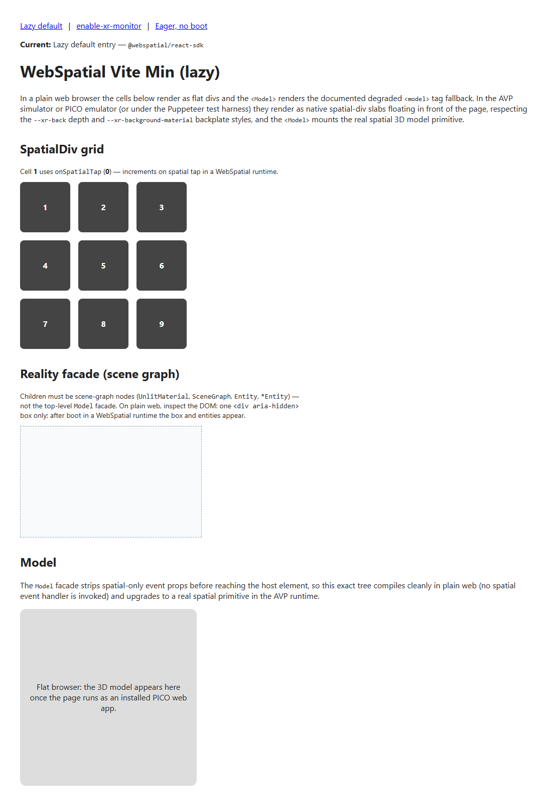

# Official examples

Examples written by the WebSpatial team, brought into the kit where the license allows it and
linked where it does not. **The labs win when anything here disagrees with them**: most official
samples still target SDK 1.x, and the kit pins 2.0.0 (`labs/VERSIONS.md`).

## Vendored (runs from this folder)

| Example | What it shows | Academy level | SDK | Status | Run |
|---|---|---|---|---|---|
| [`webspatial-vite-min/`](webspatial-vite-min/) | The WebSpatial team's own **2.0** reference app, three pages. **Lazy:** `<SpatialBoot>`, a 3x3 `enable-xr` grid (`--xr-back`, `--xr-background-material`, `onSpatialTap`), a `<Reality>` scene graph (`UnlitMaterial`, `SceneGraph`, `Entity`, `BoxEntity`) and a `<Model>`. **enable-xr-monitor:** layout changes that re-sync nested spatial panels, booted with `bootSpatial()`. **Eager:** the `@webspatial/react-sdk/eager` entry with no boot step. | L1 (grid), L3 (Reality + Model), L5 (lazy vs eager entries, `enable-xr-monitor`) | 2.0.0, no vite-plugin | Desktop VERIFIED 2026-09-24: `npm run build` clean; dev and preview in headless Chrome, 0 console errors or warnings on all 3 pages; `__webspatialsdk__` 2.0.0. Emulator: not run yet. | `cd examples/webspatial-vite-min && npm run dev:xr`, then `adb -s emulator-5554 reverse tcp:5501 tcp:5501`, open `http://localhost:5501/`, install as a Web App |

**Packages.** There is no second `npm install`. Each example's `predev` / `prebuild` runs
`link-labs.mjs`, which makes `examples/node_modules` a junction to `labs/node_modules`, so the
examples resolve the same pinned SDK 2.0.0 as the labs. Run `npm run labs:install` from the kit
root first. Ports: 5501 (dev), 5502 (preview).

**Upstream notes.** It is a test fixture, not a polished demo, so the UI is plain. Its `<Model>`
was USDZ (a visionOS format); the kit swaps in the p3 avocado GLB when the UA is PICO. It has no
`initScene`, so it needs no `onReady`; for multi-window, lab p4 is the reference. Full change list:
[`webspatial-vite-min/NOTICE`](webspatial-vite-min/NOTICE).

## More from the docs (linked, not vendored)

| Example | What it teaches | SDK | License | Level | Get it |
|---|---|---|---|---|---|
| [webspatial-sdk `apps/spatial-next-min`](https://github.com/webspatial/webspatial-sdk/tree/main/apps/spatial-next-min) | Next.js 15 App Router + lazy entry | 2.0 | MIT | L5 | `git clone -c core.longpaths=true https://github.com/webspatial/webspatial-sdk` |
| [`apps/spatial-next-eager-min`](https://github.com/webspatial/webspatial-sdk/tree/main/apps/spatial-next-eager-min) | Next.js with the `/eager` entry | 2.0 | MIT | L5 | same repo |
| [`apps/spatial-remix-min`](https://github.com/webspatial/webspatial-sdk/tree/main/apps/spatial-remix-min) | React Router 7 framework mode | 2.0 | MIT | L5 | same repo |
| [`apps/spatial-rspack-min`](https://github.com/webspatial/webspatial-sdk/tree/main/apps/spatial-rspack-min) | Rspack instead of Vite | 2.0 | MIT | L5 | same repo |
| [`apps/test-server`](https://github.com/webspatial/webspatial-sdk/tree/main/apps/test-server) | The SDK's own per-API test pages | 2.0 | MIT | L5 reference | same repo |
| [sample-solarsystem](https://github.com/webspatial/sample-solarsystem) | Spatialized educational solar system (three.js + panels) | 1.6 + vite-plugin | none stated | L3 | `git clone https://github.com/webspatial/sample-solarsystem` (needs a 2.0 port) |
| [sample-techshop](https://github.com/webspatial/sample-techshop) | Spatialized e-commerce GUI | 1.1 + vite-plugin 0.1 | none stated | L2 | `git clone https://github.com/webspatial/sample-techshop` |
| [WebSpatialPlayground](https://github.com/webspatial/WebSpatialPlayground) | Panels, depth, 3D and multi-scene | 1.7 + vite-plugin | none stated | L2 to L4 | `git clone https://github.com/webspatial/WebSpatialPlayground` |
| [widget-generator](https://github.com/webspatial/widget-generator) | Clock / weather / whiteboard widgets as separate scenes | 1.0 + vite-plugin | MIT | L4 | `git clone https://github.com/webspatial/widget-generator` (Tailwind + shadcn) |
| [snipcode](https://github.com/webspatial/snipcode) | Small snippets for SDK features | "latest" as of 2025-06 (1.x) + vite-plugin | MIT | L2 | `git clone https://github.com/webspatial/snipcode` (Tailwind) |
| [quick-example](https://github.com/webspatial/quick-example) | The docs' original quick example | 0.1.16 | none stated | history only | too old for the kit |
| [doubaodemo](https://github.com/webspatial/doubaodemo) | Radix UI + WebSpatial recommendations | a pkg.pr.new preview build | none stated | L5 | `git clone https://github.com/webspatial/doubaodemo` |
| [@webspatial/starter](https://www.npmjs.com/package/@webspatial/starter) | Scaffolds a project + AI docs and skills | template pins **^1.5.0** | MIT | L0 / L5 | see the warning below |
| [webspatial.dev showcase](https://webspatial.dev/showcase) | Community apps | mixed | per app | inspiration | browse |

**Why only one is vendored.** Only the webspatial-sdk monorepo, widget-generator and snipcode carry
a license. Repos with no license file are all rights reserved by default, so the kit links them.
widget-generator and snipcode are MIT, but they are SDK 1.x apps on Tailwind and shadcn, which
would need a second dependency tree, and they were not ported before the workshop.

## Where official material disagrees with the kit

- **`@webspatial/starter` 0.1.0 scaffolds SDK `^1.5.0`** (plus `@webspatial/builder` and
  `platform-visionos`). A project made with it is a 1.x project. To follow the labs, set both SDK
  packages to `2.0.0` and wrap the app in `<SpatialBoot>`.
- **Every standalone sample repo is 1.x and uses `@webspatial/vite-plugin`**, which fails to build
  on 2.0 (`labs/VERSIONS.md`). Only the `apps/*` fixtures inside webspatial-sdk are 2.0.
- **The 2.0 fixtures rely on `@vitejs/plugin-react` reading `jsxImportSource` from tsconfig.** On
  Vite 8 the kit passes it to `react({ jsxImportSource })` explicitly (kit rule 2), and the
  vendored copy does the same.
- **The 2.0 fixtures never call `onReady`**, because they register no scenes. That fits the kit:
  its `onReady` rule covers scene registration only.
