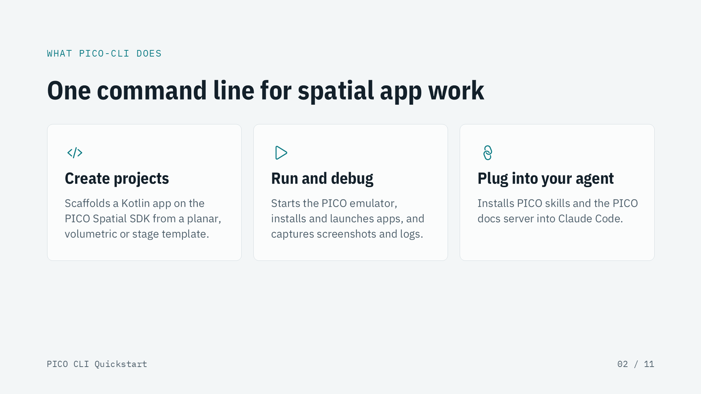
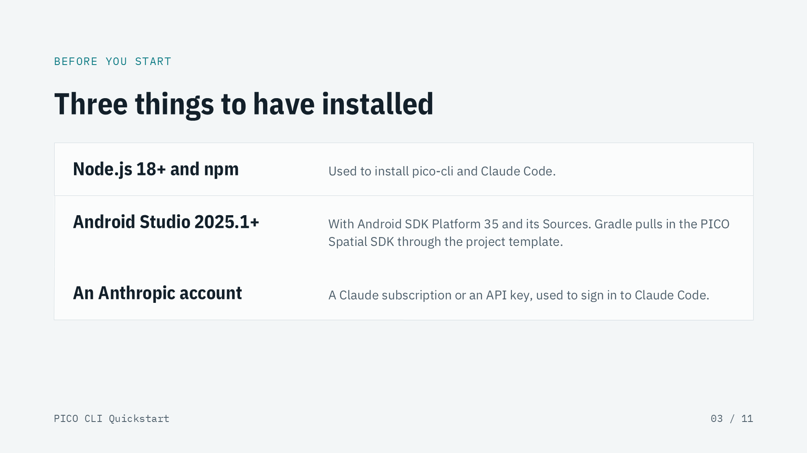
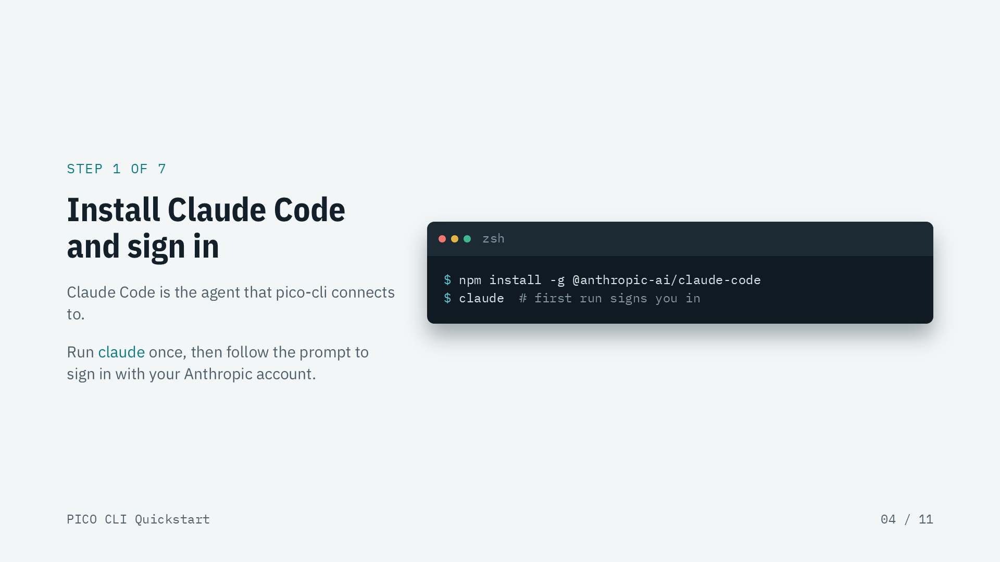
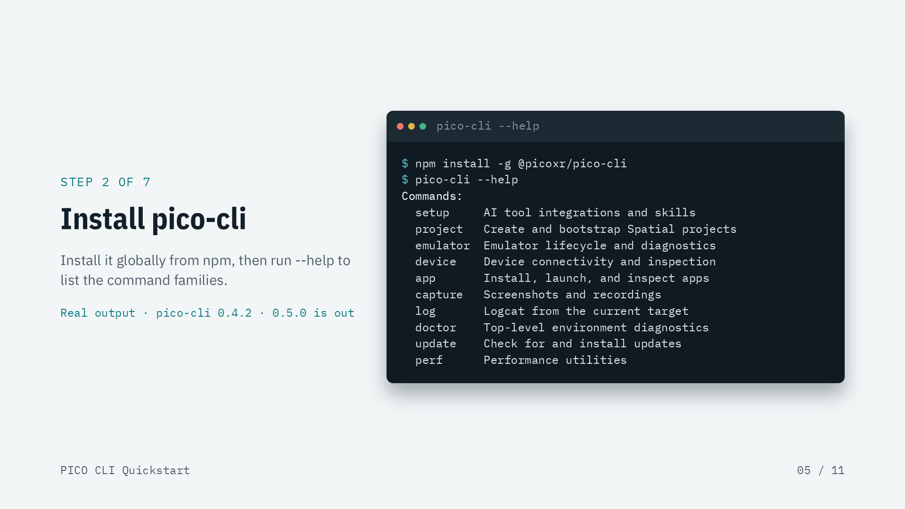
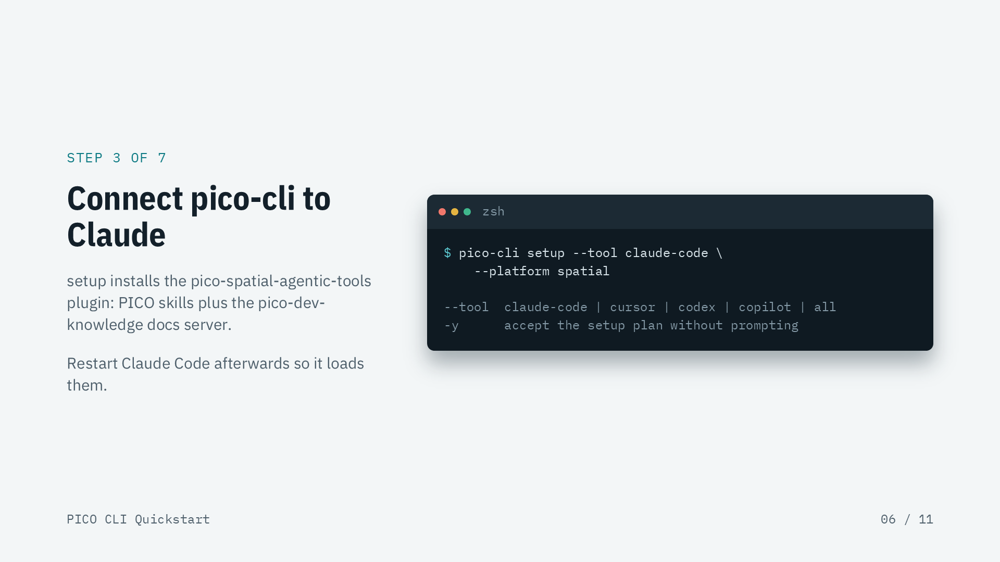
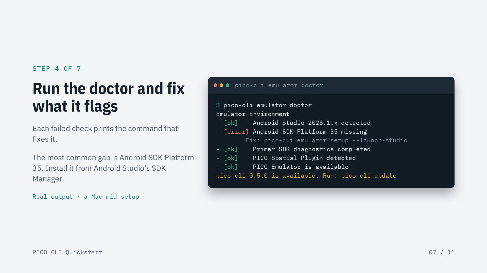
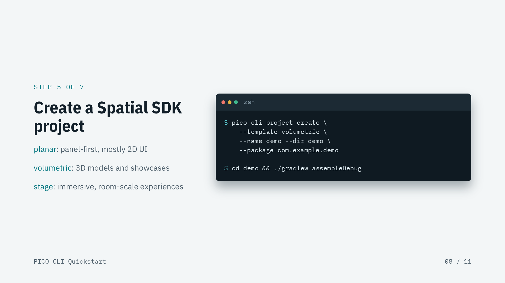
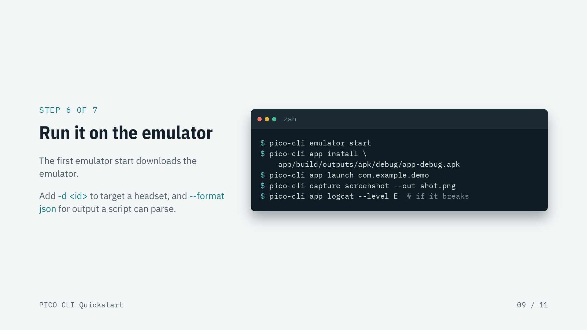
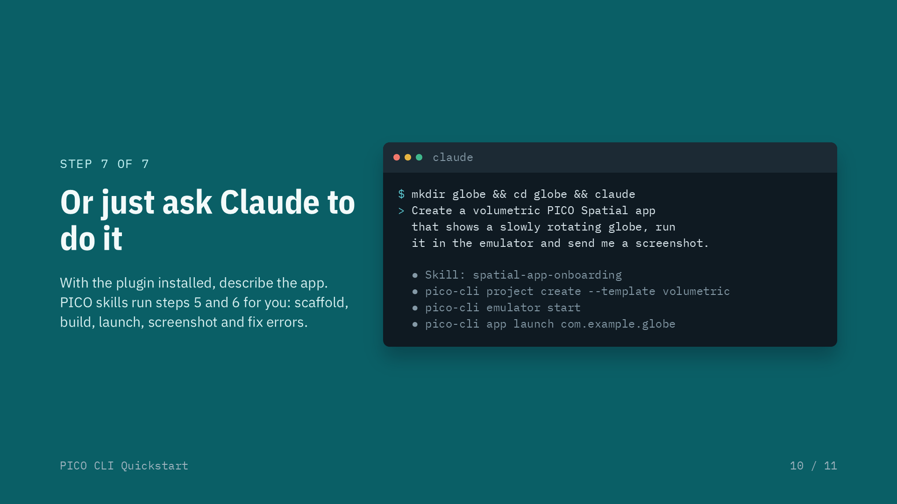
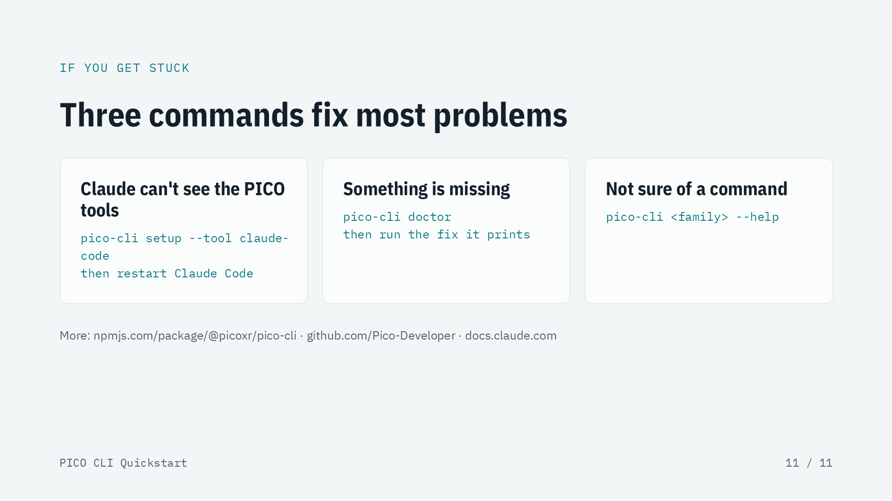

# PICO CLI Quickstart (David Oh, PICO)

Verbatim text extracted from the unmodified deck `PICO CLI Quickstart.pptx`, for agents and screen readers. Slide images: `slides/slide-NN.png`.

## Slide 1


```text
GETTING STARTED · PICO-CLI
Build a PICO Spatial app with Claude, from zero
Install the CLI, connect it to Claude Code, and get a first Spatial SDK app running on the PICO emulator.
PICO CLI Quickstart
01 / 11
```

## Slide 2



```text
WHAT PICO-CLI DOES
One command line for spatial app work
Create projects
Scaffolds a Kotlin app on the PICO Spatial SDK from a planar, volumetric or stage template.
Run and debug
Starts the PICO emulator, installs and launches apps, and captures screenshots and logs.
Plug into your agent
Installs PICO skills and the PICO docs server into Claude Code.
PICO CLI Quickstart
02 / 11
```

## Slide 3



```text
BEFORE YOU START
Three things to have installed
Node.js 18+ and npm
Used to install pico-cli and Claude Code.
Android Studio 2025.1+
With Android SDK Platform 35 and its Sources. Gradle pulls in the PICO Spatial SDK through the project template.
An Anthropic account
A Claude subscription or an API key, used to sign in to Claude Code.
PICO CLI Quickstart
03 / 11
```

## Slide 4



```text
STEP 1 OF 7
Install Claude Code and sign in
Claude Code is the agent that pico-cli connects to.
Run claude once, then follow the prompt to sign in with your Anthropic account.
zsh
$ npm install -g @anthropic-ai/claude-code
$ claude  # first run signs you in
PICO CLI Quickstart
04 / 11
```

## Slide 5



```text
STEP 2 OF 7
Install pico-cli
Install it globally from npm, then run --help to list the command families.
Real output · pico-cli 0.4.2 · 0.5.0 is out
pico-cli --help
$ npm install -g @picoxr/pico-cli
$ pico-cli --help
Commands:
  setup     AI tool integrations and skills
  project   Create and bootstrap Spatial projects
  emulator  Emulator lifecycle and diagnostics
  device    Device connectivity and inspection
  app       Install, launch, and inspect apps
  capture   Screenshots and recordings
  log       Logcat from the current target
  doctor    Top-level environment diagnostics
  update    Check for and install updates
  perf      Performance utilities
PICO CLI Quickstart
05 / 11
```

## Slide 6



```text
STEP 3 OF 7
Connect pico-cli to Claude
setup installs the pico-spatial-agentic-tools plugin: PICO skills plus the pico-dev-knowledge docs server.
Restart Claude Code afterwards so it loads them.
zsh
$ pico-cli setup --tool claude-code \
    --platform spatial
--tool  claude-code | cursor | codex | copilot | all
-y      accept the setup plan without prompting
PICO CLI Quickstart
06 / 11
```

## Slide 7



```text
STEP 4 OF 7
Run the doctor and fix what it flags
Each failed check prints the command that fixes it.
The most common gap is Android SDK Platform 35. Install it from Android Studio's SDK Manager.
Real output · a Mac mid-setup
pico-cli emulator doctor
$ pico-cli emulator doctor
Emulator Environment
- [ok]    Android Studio 2025.1.x detected
- [error] Android SDK Platform 35 missing
        Fix: pico-cli emulator setup --launch-studio
- [ok]    Primer SDK diagnostics completed
- [ok]    PICO Spatial Plugin detected
- [ok]    PICO Emulator is available
pico-cli 0.5.0 is available. Run: pico-cli update
PICO CLI Quickstart
07 / 11
```

## Slide 8



```text
STEP 5 OF 7
Create a Spatial SDK project
planar: panel-first, mostly 2D UI
volumetric: 3D models and showcases
stage: immersive, room-scale experiences
zsh
$ pico-cli project create \
    --template volumetric \
    --name demo --dir demo \
    --package com.example.demo
$ cd demo && ./gradlew assembleDebug
PICO CLI Quickstart
08 / 11
```

## Slide 9



```text
STEP 6 OF 7
Run it on the emulator
The first emulator start downloads the emulator.
Add -d <id> to target a headset, and --format json for output a script can parse.
zsh
$ pico-cli emulator start
$ pico-cli app install \
    app/build/outputs/apk/debug/app-debug.apk
$ pico-cli app launch com.example.demo
$ pico-cli capture screenshot --out shot.png
$ pico-cli app logcat --level E  # if it breaks
PICO CLI Quickstart
09 / 11
```

## Slide 10



```text
STEP 7 OF 7
Or just ask Claude to do it
With the plugin installed, describe the app. PICO skills run steps 5 and 6 for you: scaffold, build, launch, screenshot and fix errors.
claude
$ mkdir globe && cd globe && claude
> Create a volumetric PICO Spatial app
  that shows a slowly rotating globe, run
  it in the emulator and send me a screenshot.
  ● Skill: spatial-app-onboarding
  ● pico-cli project create --template volumetric
  ● pico-cli emulator start
  ● pico-cli app launch com.example.globe
PICO CLI Quickstart
10 / 11
```

## Slide 11



```text
IF YOU GET STUCK
Three commands fix most problems
Claude can't see the PICO tools
pico-cli setup --tool claude-code
then restart Claude Code
Something is missing
pico-cli doctor
then run the fix it prints
Not sure of a command
pico-cli <family> --help
More: npmjs.com/package/@picoxr/pico-cli · github.com/Pico-Developer · docs.claude.com
PICO CLI Quickstart
11 / 11
```

## Slide 12


```text
PICO EARLY ACCESS DEVELOPER PROGRAM
Invitees get up to $1500 for publishing their AI generated application
October 1-Nov 11 2026
Hardware Access
```
