# PICO WebSpatial Academy: slide deck

Generated by `slides/build.mjs` from `slides/src/*.md`. Same slide ids as `index.html` and `deck.json`. Do not edit by hand.

## PICO WebSpatial Academy {#intro-s1}

*id: intro-s1 · level: intro · step: 1 · kind: concept*

Take an ordinary website, make it spatial, and run it in the PICO OS 6 emulator. Claude Code does the typing.

Six levels, from an empty laptop to your own site floating in space. Every step has one action, the exact command or prompt, and what you should see.

> **Speaker notes:** Open on this slide while people settle. Press I for the level index, N to hide these notes, 0 to 5 to jump to a level. The follow-along link is this same page: it scrolls on a phone.

## Three facts before you start {#intro-s2}

*id: intro-s2 · level: intro · step: 2 · kind: concept*

Each one has cost someone an hour. Say them out loud.

- **WebSpatial requires React.** It works by replacing React's JSX runtime. There is no plain-HTML path today.
- **WebSpatial needs PICO OS 6.** The emulator is PICO OS 6 and has the runtime built in, so you open a URL and nothing gets packaged. A PICO 4 Ultra runs OS 5.x and shows a flat page.
- **The SDK just moved to 2.0.** `@webspatial/react-sdk` 2.0.0 is what the labs pin. We teach the 2.x API (`<SpatialBoot>`). Older guides use `@webspatial/vite-plugin` and `XR_ENV=avp`, which belong to 1.x.

> **Speaker notes:** Source: curriculum/SYLLABUS.md "Three facts before you start". If someone has a 1.x project, point them at curriculum/TROUBLESHOOTING.md#version-drift and move on.

## Six levels, three hours {#intro-s3}

*id: intro-s3 · level: intro · step: 3 · kind: concept*

Pass each lab's check before you start the next level. Press 0 to 5 to jump.

- L0 · Setup: 25 min in the room, 2 h self-paced, lab setup
- L1 · Hello Spatial: 25 min in the room, 1.5 h self-paced, lab labs/p1-hello-spatial
- L2 · Spatialize a website: 45 min in the room, 3 h self-paced, lab labs/p2-spatialize-site
- L3 · 3D + volumes: 30 min in the room, 2.5 h self-paced, lab labs/p3-volume-model
- L4 · Space Invaders in depth: 30 min in the room, 2.5 h self-paced, lab labs/p4-space-invaders
- L5 · Agentic expert: 25 min in the room, 4 h self-paced, lab labs/p5-capstone

L2 is the headline lab. The emulator install is **pre-work**: don't try to install Android Studio in the room.

> **Speaker notes:** Run of show from SYLLABUS.md: 0:00 L0 check-in (25), 0:25 L1 (25), 0:50 L2 (45), 1:35 break (10), 1:45 L3 (30), 2:15 L4 (30), 2:45 L5 (15 in the room), 3:00 end. L4 can be demo-only if the room is behind. Self-paced total is about 15.5 h.

## How the pieces talk {#intro-s4}

*id: intro-s4 · level: intro · step: 4 · kind: concept*

Four things on one machine. Claude Code drives all of them.

- **Node + Vite** serves your site on a port per lab (5301 for lab 1).
- **PICO OS 6 emulator** is a PICO device in a window, built on the Android emulator.
- **pico-cli** is PICO's one command line for the emulator, apps, logs, screenshots and perf.
- **Claude Code** runs pico-cli and the dev server, and asks the `pico-dev-knowledge` MCP about PICO docs.

The emulator opens your site at `http://localhost:<port>/`, mapped to your machine with `adb reverse`. `node setup/launch.mjs <n>` does the mapping for you.

> **Speaker notes:** The localhost-through-adb-reverse point comes back in every level; land it here once. MEASURED on the OS 6 emulator (emulator-lab + labs-builder, 2026-09-24): http://10.0.2.2:<port>/ loads but reports isSecureContext=false, beforeinstallprompt never fires, and the page stays a flat tab. localhost through adb reverse is a secure context, and Lab 1 installed as com.picoxr.webapp.localhost.* with depth. PICO's docs say 10.0.2.2; the measurement overrides them for this workshop (assets/pico-docs/WEB-APP-RUNTIME.md section 3, kit CLAUDE.md, setup/launch.mjs).

## From PICO: PICO CLI Quickstart, David Oh {#intro-s5}

*id: intro-s5 · level: intro · step: 5 · kind: concept*

David Oh's deck is the native Spatial SDK (Kotlin) path. The Academy is the WebSpatial path to the same PICO OS 6 emulator.

- **His path:** `pico-cli project create` a planar, volumetric or stage app in Kotlin, build it, then install and launch it in the emulator.
- **Our path:** a React website, spatialized with WebSpatial, opened as a Web App in the same emulator.
- Same pico-cli, same emulator, same Claude Code wiring.

[Open David Oh's deck: PICO CLI Quickstart](../partner/pico-cli-quickstart-david-oh/index.html)

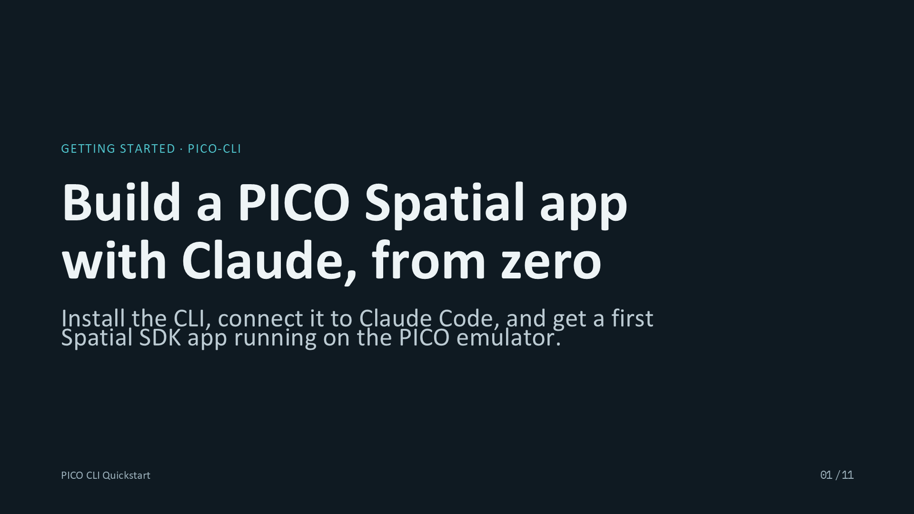

> **Speaker notes:** Sent by David Oh (PICO) on 2026-09-24 for tonight. It's presented exactly as sent: never edit or re-theme anything in partner/. Its README lists where our kit is more specific (for example, pico-cli 0.5.0 accepts only Android Studio 2025.1.x); those are answers for questions, not corrections to his slides.

## Setup: Claude Code, Node, pico-cli and the PICO OS 6 emulator {#L0-s1}

*id: L0-s1 · level: 0 · step: 1 · kind: concept*

25 minutes in the room, because the install is pre-work. 2 hours self-paced.

- **Why the emulator, not a headset:** WebSpatial needs PICO OS 6. The emulator is OS 6. A PICO 4 Ultra is OS 5.x.
- **Emulator machine:** Windows 10/11 or an Apple Silicon Mac, 16 GB RAM (32 GB is comfortable), about 40 GB free disk, an NVIDIA GeForce GTX 1060 or better.
- **Below that bar?** You take the web-only track: every lab runs flat in a desktop browser.
- **Git, and Node 20.19+ or 22.12+** (Vite 8's floor). A paid Claude plan for Claude Code.
- **Licence:** the PICO Emulator and PICO WebSpatial browser are PICO-licensed. PICO has cleared tonight's attendees to use both.

> **Speaker notes:** Sources: curriculum/L0.md, SYLLABUS.md prerequisites, setup/SETUP.md. The kit recommends Node 24 LTS. Claude Code needs a Pro, Max, Team, Enterprise or Console account; the free plan doesn't include it. The full install walk-through is setup/SETUP.md; exact versions are in setup/DEPENDENCIES.md.

## Android Studio 2025.1.x. Exactly. {#L0-s2}

*id: L0-s2 · level: 0 · step: 2 · kind: concept*

PICO's plugin only loads in Android Studio 2025.1.x. The default winget and brew installs give you 2026.1, which will not work.

- Already on a newer release? Install 2025.1.4.8 **beside** it. Don't uninstall anything.

```bash
winget install --id Google.AndroidStudio -e --version 2025.1.4.8   # Windows
```

```bash
bash setup/install-macos.sh --yes --emulator   # macOS
```

You should see:

```text
Android Studio → Help → About shows 2025.1.4.8. After you get the kit (L0-s5), npm run doctor confirms it.
```

> **Speaker notes:** Source: setup/SETUP.md step 10 and curriculum/L0.md "Common mistakes". Say it twice: this is the install mistake that costs the most time.

## Install Claude Code {#L0-s3}

*id: L0-s3 · level: 0 · step: 3 · kind: step*

**Do this:** Run the native installer for your OS, then check it.

```bash
irm https://claude.ai/install.ps1 | iex   # Windows (PowerShell)
```

```bash
curl -fsSL https://claude.ai/install.sh | bash   # macOS
```

```bash
claude doctor
```

You should see:

```text
claude doctor explains anything wrong with the install. claude --version prints a version number.
```

> **Speaker notes:** Needs a Pro, Max, Team, Enterprise or Console account (curriculum/L0.md). On Windows, install Git first.

## Confirm Node and pico-cli {#L0-s4}

*id: L0-s4 · level: 0 · step: 4 · kind: step*

**Do this:** Check Node's version and install pico-cli from its scoped package.

Skip the install if the version check already works. After any winget install, close and reopen the terminal so it finds the new command.

```bash
winget install --id OpenJS.NodeJS.LTS -e
```

```bash
node --version
```

```bash
npm install -g @picoxr/pico-cli
```

```bash
pico-cli --version
```

You should see:

```text
node prints v20.19+ or v22.12+.
pico-cli prints pico-cli/0.5.x, for example: pico-cli/0.5.0 (public) win32-x64 node-v22.17.0
```

> **Speaker notes:** The unscoped npm package `pico-cli` is an unrelated tool; the real one is @picoxr/pico-cli. The example version line is the kit laptop's real output on 2026-09-24.

## Get the kit {#L0-s5}

*id: L0-s5 · level: 0 · step: 5 · kind: step*

**Do this:** Clone the workshop repo and install every lab's dependencies once.

Skip the install if the version check already works. After any winget install, close and reopen the terminal so it finds the new command.

```bash
winget install --id Git.Git -e
```

```bash
git clone https://github.com/RayyanZahid/pico-workshops.git
```

```bash
cd pico-workshops/webspatial-academy
```

```bash
npm run labs:install
```

You should see:

```text
A pico-workshops folder with webspatial-academy inside. labs:install runs one npm workspace install that serves every lab.
```

> **Speaker notes:** Public repo: https://github.com/RayyanZahid/pico-workshops (the Academy lives in webspatial-academy/). Every later command runs from that folder. Needs Git: Windows `winget install --id Git.Git -e`, macOS `xcode-select --install` (curriculum/L0.md). Next: npm run doctor.

## Run the doctors {#L0-s6}

*id: L0-s6 · level: 0 · step: 6 · kind: step*

**Do this:** Run the kit's doctor, then have Claude Code turn pico-cli's failures into a fix list.

```bash
npm run doctor
```

Claude Code prompt:

```text
Run `pico-cli doctor --format json`, group every failing check by module, and give me the exact fix command for each one. Do not run any --fix yet.
```

You should see:

```text
The kit doctor tells you your track: emulator or web-only. pico-cli doctor groups its checks by module. Red lines are fine for now, as long as each one gets a fix or a written reason.
```

> **Speaker notes:** npm run doctor is node setup/doctor.mjs: read-only, about 10 s. "Do not run any --fix yet" is deliberate: `pico-cli doctor --fix` also git-pulls PICO's plugin repo, so people should see the plan first.

## Give Claude Code PICO's skills and docs {#L0-s7}

*id: L0-s7 · level: 0 · step: 7 · kind: step*

**Do this:** Wire the PICO plugin skills and the pico-dev-knowledge MCP into Claude Code.

Close your other Claude Code sessions first. Setup can restart the knowledge backend out from under them.

```bash
pico-cli setup --agent-tool claude-code --platform spatial --scope global --yes
```

```bash
pico-cli plugin doctor
```

You should see:

```text
plugin doctor reports the skills installed. Restart Claude Code so it loads the new skills and MCP server.
```

> **Speaker notes:** Also run `pico-cli knowledge doctor`: it should report the knowledge base ready. Re-running pico-cli setup while other sessions are open kills every session's pico-dev-knowledge MCP server. Run it once, before the workshop.

## 16 GB of RAM? Do this before you boot. {#L0-s8}

*id: L0-s8 · level: 0 · step: 8 · kind: concept*

The emulator reserves 6 GB by default. On 16 GB, make room first.

- Close Chrome, Slack, Android Studio and anything else heavy.

```bash
wsl --shutdown   # Windows
```

- With the emulator stopped, set this in `~/.pico/avd/<avd name>.avd/config.ini`:

```tsx
hw.ramSize=4096
```

> **Speaker notes:** A 16 GB laptop booted this way on 2026-09-24; page rendering at 4096 is still being confirmed. Source: setup/SETUP.md step 13 and the kit CLAUDE.md. Windows path: %USERPROFILE%\.pico\avd\PICO_6.0.avd\config.ini. "Insufficient RAM free" goes to stderr only, never the emulator log. labs/EMULATOR-RESULTS.md measured about 2 GB of free commit on a 16 GB laptop with Chrome, WSL and node running, against 6,144 MB needed.

## Boot the emulator {#L0-s9}

*id: L0-s9 · level: 0 · step: 9 · kind: step*

**Do this:** Start the PICO OS 6 emulator from a terminal and wait for adb.

Run it in a terminal you can see. If it dies, the real reason is printed there and nowhere else.

```bash
pico-cli emulator start
```

You should see:

```text
The emulator window opens and the command returns once adb is ready.
"Insufficient RAM free" means go back to the 16 GB recipe.
```

Claude Code prompt:

```text
Start the PICO emulator with `pico-cli emulator start`, wait for adb readiness, then run `pico-cli emulator status` and `pico-cli device list` and tell me the device id to use for the rest of the day.
```

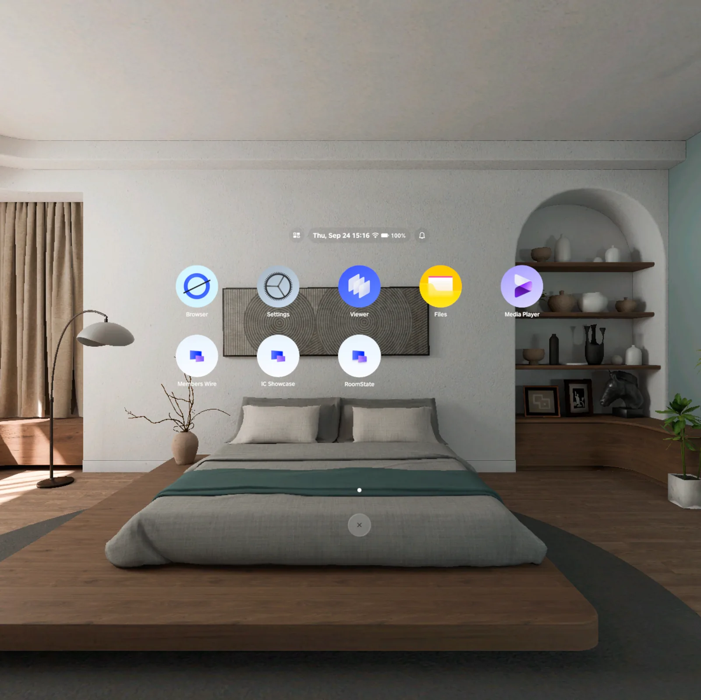
*PICO OS 6 emulator, shown with PICO's clearance for this workshop*

> **Speaker notes:** If start fails for any reason other than RAM, run `pico-cli emulator doctor` first. On Windows, bare `adb` may not be on PATH after an Android Studio install: the full path is %LOCALAPPDATA%\Android\Sdk\platform-tools\adb.exe. launch.mjs and snap.mjs find it automatically.

## Get your device id {#L0-s10}

*id: L0-s10 · level: 0 · step: 10 · kind: step*

**Do this:** Confirm the emulator is up and note its device id for the rest of the day.

```bash
pico-cli emulator status
```

```bash
pico-cli device list
```

You should see:

```text
Process running: yes
ADB online: yes
device list shows one device, usually emulator-5554.
```

> **Speaker notes:** The status lines are from setup/SETUP.md step 13. Anyone stuck here pairs with a neighbour whose emulator runs, per the run of show.

## Prepare the web runtime {#L0-s11}

*id: L0-s11 · level: 0 · step: 11 · kind: step*

**Do this:** Download the PICO WebSpatial browser package that web launch uses.

```bash
pico-cli web setup
```

You should see:

```text
The command exits 0. If you skip it, the first launch downloads it instead.
```

> **Speaker notes:** From L0.md install table step 8 and setup/SETUP.md.

## Checkpoint: you are set up when... {#L0-s12}

*id: L0-s12 · level: 0 · step: 12 · kind: checkpoint*

Every box ticked, or a written reason next to it.

- `npm run doctor` names your track, and `pico-cli doctor` is clean or explained.
- `pico-cli emulator status` shows a running emulator, or you're on the web-only track.
- You know your device id (usually `emulator-5554`).
- You can say why the emulator opens `localhost` through `adb reverse`, not `10.0.2.2`.

`adb reverse` makes the emulator's `localhost:<port>` your machine's port, and `localhost` is a secure context. 10.0.2.2 loads but was not a secure context in our test (no install); use localhost.

## Lab: setup {#L0-s13}

*id: L0-s13 · level: 0 · step: 13 · kind: lab*

The L0 lab is the setup guide itself: doctor clean or explained, emulator running.

Work through `setup/SETUP.md` step by step. If your emulator isn't installed yet, pair with a neighbour whose emulator is.

## Hello Spatial: your first WebSpatial app {#L1-s1}

*id: L1-s1 · level: 1 · step: 1 · kind: concept*

A website becomes an app in the room. You keep writing HTML and CSS.

- **Not WebXR.** WebXR gives you a canvas and a head pose, and you draw every pixel. WebSpatial gives the OS your HTML to render next to other apps.
- **Window scene:** a 2D panel for GUI. It keeps the same apparent size, so text stays readable.
- **Volume scene:** a box with real depth, in metres, for showing an object.
- **React is required.** The SDK hooks React's JSX runtime. A static .html file never passes through it.
- **No packaging on PICO OS 6.** Run the dev server, open the URL, install it as a Web App from the address bar.

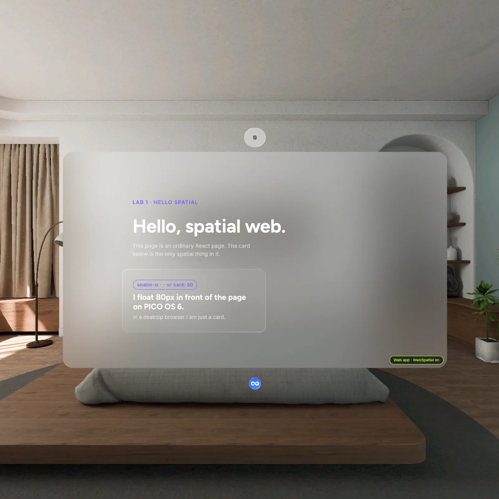
*PICO OS 6 emulator, shown with PICO's clearance for this workshop*

> **Speaker notes:** From curriculum/L1.md. The WebXR vs WebSpatial table is worth drawing on a whiteboard if the room is mixed. visionOS is the other platform, and it needs @webspatial/builder and a Mac.

## A browser tab is flat. A Web App has depth. {#L1-s2}

*id: L1-s2 · level: 1 · step: 2 · kind: concept*

WebSpatial only switches on inside PICO OS 6's Web App Runtime. The button in the address bar is the door.

## Browser tab
- Your page, in a PICO Browser tab.
- **Flat.** `enable-xr` and `--xr-*` do nothing here.
- `display-mode` is `browser`.

## Web App
- Install it from the address bar: the monitor icon, titled Install app on OS 6.0.0 (PICO's docs call it Open as standalone app).
- **Depth.** WebSpatial switches on: elements lift, `window.open` opens new windows.
- Needs a secure URL: `localhost` via `adb reverse`.
- `display-mode` is `standalone` or `minimal-ui`.

> **Speaker notes:** PICO's docs (assets/pico-docs/WEB-APP-RUNTIME.md, from developer.picoxr.com/document/web/webspatial/ and /install-free/): "In the Web App Runtime of PICO OS 6, any WebSpatial API used in your page source is automatically activated." The button only appears when the URL falls inside a Web App's manifest scope. No install needed for development, and no WebSpatial Builder on PICO. webspatial.dev calls the same button "Run as a standalone app"; PICO's label is "Open as standalone app".

## What the Web App needs {#L1-s3}

*id: L1-s3 · level: 1 · step: 3 · kind: concept*

No install, no depth. Two things decide whether the page can become a Web App.

- **A secure URL.** In the emulator open `http://localhost:<port>/` through `adb reverse`; `node setup/launch.mjs <n>` sets this up. 10.0.2.2 loads but was not a secure context in our test (no install); use localhost.
- **A manifest with the 4 required fields:** `name` (or `short_name`), `icons`, `start_url`, `display`. Link it with `<link rel="manifest" href="/app.webmanifest">` and serve it as JSON (`application/manifest+json`).

To see the adb reverse it will run, without running it:

```bash
node setup/launch.mjs 1 --dry-run
```

```tsx
{ "name": "Hello Spatial", "start_url": "/", "display": "minimal-ui",
  "icons": [ { "src": "/icons/icon-512.png", "sizes": "512x512", "type": "image/png" } ] }
```

> **Speaker notes:** MEASURED on the OS 6 emulator (emulator-lab + labs-builder, 2026-09-24): http://10.0.2.2:<port>/ loads but reports isSecureContext=false, beforeinstallprompt never fires, and the page stays a flat tab. localhost through adb reverse is a secure context, and Lab 1 installed as com.picoxr.webapp.localhost.* with depth. PICO's docs say 10.0.2.2; the measurement overrides them for this workshop (assets/pico-docs/WEB-APP-RUNTIME.md section 3, kit CLAUDE.md, setup/launch.mjs). Manifest rules: developer.picoxr.com/document/web/manifest/ via WEB-APP-RUNTIME.md section 4. PICO requires display (it's optional on some other platforms). `scope` decides which URLs count as the app, and so where the button shows. On a real PICO OS 6 device HTTP needs Developer Mode plus a debug broadcast; not tonight's concern.

## Show which runtime you're in {#L1-s4}

*id: L1-s4 · level: 1 · step: 4 · kind: step*

**Do this:** Put a badge on the page that says browser or webapp.

```tsx
function getWebRuntime() {
  if (window.matchMedia('(display-mode: browser)').matches) return 'browser';
  if (window.matchMedia('(display-mode: standalone)').matches
      || window.matchMedia('(display-mode: minimal-ui)').matches) return 'webapp';
}
```

You should see:

```text
In a browser tab the badge says browser, and nothing pops out: that's expected.
Installed as a Web App it says webapp, and enable-xr elements lift.
```


*desktop Chrome*

> **Speaker notes:** From developer.picoxr.com/document/web/install-free/. Also works in CSS: @media (display-mode: standalone) { ... }. Recommended in every lab so people can see at a glance why nothing pops out.

## The whole recipe, in four lines {#L1-s5}

*id: L1-s5 · level: 1 · step: 5 · kind: concept*

No vite-plugin. No XR_ENV. One bundle; PICO is detected at runtime from the user agent.

```bash
npm i @webspatial/react-sdk@2.0.0 @webspatial/core-sdk@2.0.0 --save-exact
```

```tsx
// 2. tsconfig: "jsxImportSource": "@webspatial/react-sdk"   AND   vite.config.ts:
react({ jsxImportSource: '@webspatial/react-sdk' })
// 3. main.tsx
<SpatialBoot><App /></SpatialBoot>
// 4. index.html
<link rel="manifest" href="/app.webmanifest">
```

After the four steps below, mark something: `<div enable-xr>` with `position: relative`, `--xr-back: 80` (px) and `--xr-background-material: translucent`.

> **Speaker notes:** Source: labs/VERSIONS.md and the p1/p2 lab READMEs. @webspatial/vite-plugin 1.0.1 aliases the SDK to /web, which 2.0 removed, so builds fail with it. Proven on the OS 6 emulator by emulator-lab (2026-09-24): lab 1's solution, installed as a web app, reported UA ... PicoWebApp/0.4.0 ... WebSpatial/1.5.0, react-sdk 2.0.0, and spatialized its enable-xr card (the screenshot on "Make it pop out").

## Scaffold the app {#L1-s6}

*id: L1-s6 · level: 1 · step: 6 · kind: step*

**Do this:** Ask Claude Code to scaffold a Vite + React app wired for WebSpatial 2.x.

Claude Code prompt:

```text
Scaffold a Vite + React + TypeScript app in ./hello-spatial wired for WebSpatial 2.x: install @webspatial/react-sdk and @webspatial/core-sdk, set jsxImportSource to @webspatial/react-sdk in tsconfig.app.json, wrap the root in <SpatialBoot>, add public/app.webmanifest (name, start_url /, display minimal-ui, a 512 any icon and a 1024 maskable icon) linked from index.html, set react({ jsxImportSource: '@webspatial/react-sdk' }) in vite.config.ts, and make sure npm run dev:xr binds 0.0.0.0. Run the dev server and tell me the URL the emulator should open.
```

Doing it by hand? These two are the start:

```bash
npm create vite@latest hello-spatial -- --template react-ts
```

```bash
npm i @webspatial/react-sdk@2.0.0 @webspatial/core-sdk@2.0.0 --save-exact
```

> **Speaker notes:** The next three slides are what that one prompt does, so people can check Claude's diff against them. Don't install @webspatial/vite-plugin: that's the 1.x setup.

## Route JSX through the SDK {#L1-s7}

*id: L1-s7 · level: 1 · step: 7 · kind: step*

**Do this:** Set jsxImportSource in two places: the tsconfig that holds "jsx", and vite.config.ts.

```tsx
"jsx": "react-jsx",
"jsxImportSource": "@webspatial/react-sdk"
```

```tsx
react({ jsxImportSource: '@webspatial/react-sdk' })
```

You should see:

```text
Every <div> you write in JSX now goes through WebSpatial's createElement, which is what understands enable-xr and --xr-back.
If enable-xr does nothing later, suspect this step first.
```

> **Speaker notes:** In Vite's template the tsconfig is tsconfig.app.json (curriculum/L1.md); the labs use a single tsconfig.json. The vite.config line comes from the kit CLAUDE.md: Vite 8 transforms with oxc and ignores esbuild.jsxImportSource, so without it every enable-xr goes inert with no error. curriculum/L1.md only shows the tsconfig half.

## Boot it and add the manifest {#L1-s8}

*id: L1-s8 · level: 1 · step: 8 · kind: step*

**Do this:** Wrap the app in <SpatialBoot> and link a PWA manifest.

```tsx
createRoot(document.getElementById('root')!).render(
  <SpatialBoot>
    <App />
  </SpatialBoot>,
)
```

The manifest needs `display` set to `standalone` or `minimal-ui`, plus a 1024 maskable icon with no transparency. Without a valid manifest the browser can't install it as a Web App.

You should see:

```text
In a desktop browser the app looks normal. <SpatialBoot> only loads the spatial half inside a WebSpatial runtime.
```

> **Speaker notes:** <SpatialBoot> renders nothing while it loads and has no fallback prop, so put loading UI outside it. Add onError={e => console.error(e)} if the emulator shows a blank page.

## Serve it where the emulator can reach it {#L1-s9}

*id: L1-s9 · level: 1 · step: 9 · kind: step*

**Do this:** Start lab p1's dev server in the background and open it in the emulator, from the kit root.

```bash
node setup/launch.mjs 1 --serve
```

You should see:

```text
The dev server starts in the background (log in .academy/logs/) and the emulator opens http://localhost:5301/.
```

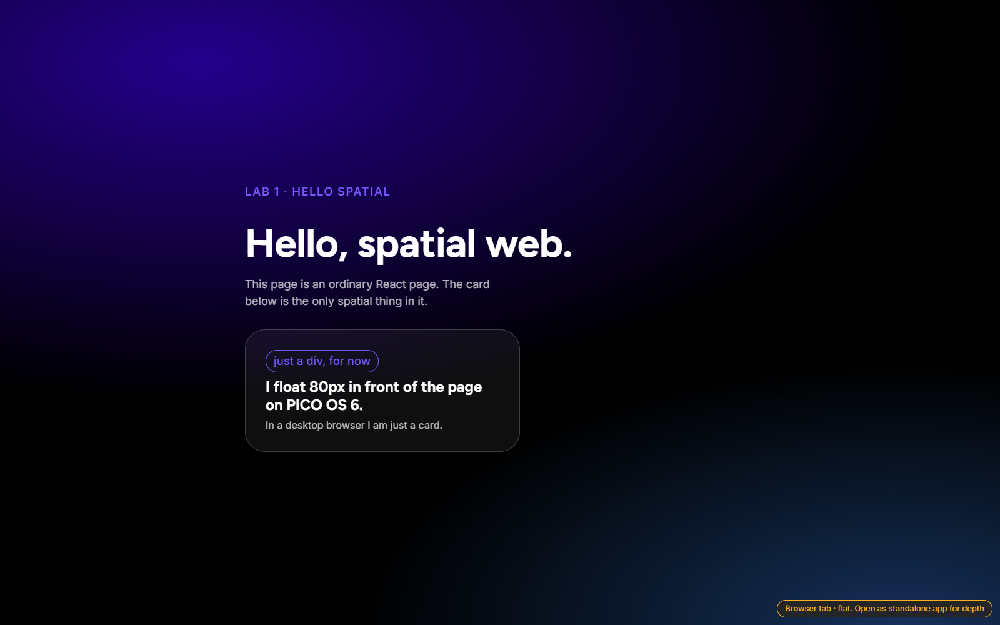
*desktop Chrome*

> **Speaker notes:** dev:xr is `vite --host 0.0.0.0 --port 5301`. Plain `dev` binds localhost only and the emulator gets connection refused. Solutions serve on 5311 to 5315.

## Open it in the emulator {#L1-s10}

*id: L1-s10 · level: 1 · step: 10 · kind: step*

**Do this:** Open lab p1 in the emulator at localhost, through adb reverse, and screenshot it.

```bash
node setup/launch.mjs 1
```

Claude Code prompt:

```text
Start lab p1 with `npm run dev:xr` in labs/p1-hello-spatial/start (port 5301), open it in the running PICO emulator with `node setup/launch.mjs 1`, wait 5 seconds, take a screenshot with `node setup/snap.mjs`, and tell me what loaded. If the frame is mostly black, take a burst before concluding anything.
```

You should see:

```text
Your page loads in the PICO Browser at http://localhost:5301/, still a flat tab. The next slides make it pop out.
```

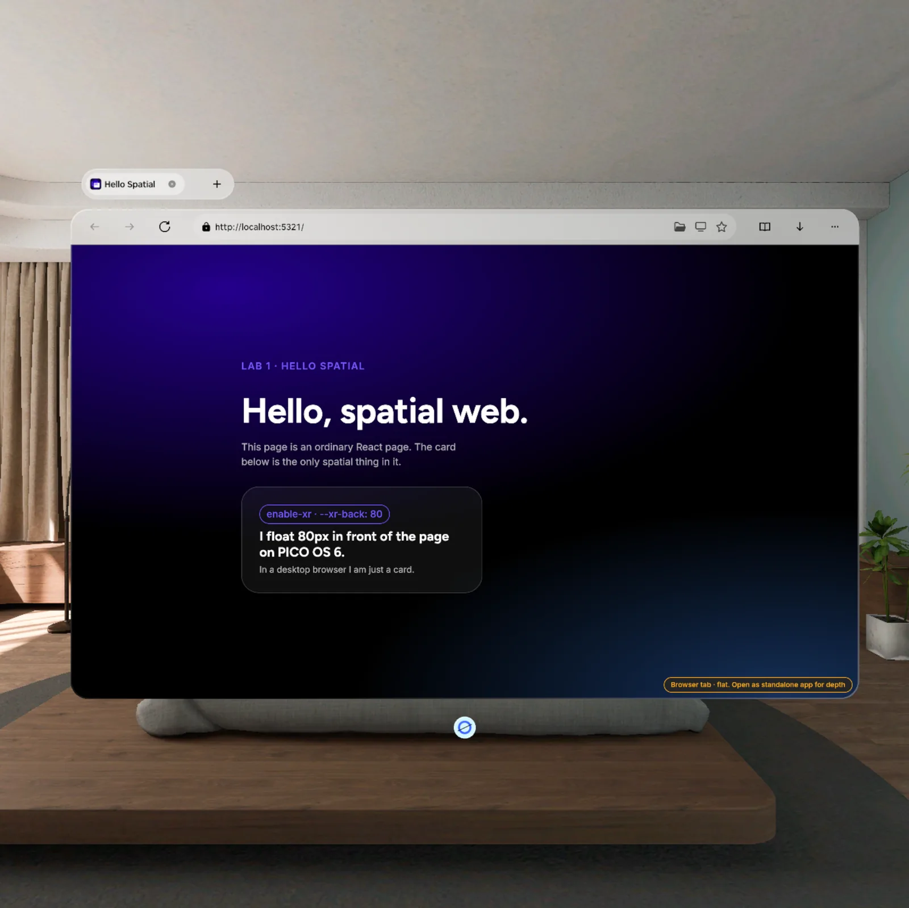
*PICO OS 6 emulator, shown with PICO's clearance for this workshop*

> **Speaker notes:** launch.mjs runs `adb reverse tcp:<port> tcp:<port>` and opens http://localhost:<port>/ in the emulator. It only calls pico-cli web launch to install the PICO browser if it's missing, because web launch rewrites localhost to the flat 10.0.2.2 URL. It refuses any target that isn't an emulator. The reverse mapping lasts until the emulator restarts. If launch.mjs fails with INSTALL_FAILED_UID_CHANGED, open the URL by hand: adb reverse tcp:P tcp:P, then type http://localhost:P/ into the PICO Browser. The p1 Web App that lifted was installed from http://localhost:5311/ (package com.picoxr.webapp.localhost.anoignjj).

## Never point web launch at a real headset {#L1-s11}

*id: L1-s11 · level: 1 · step: 11 · kind: concept*

pico-cli web launch is for the emulator only.

- It **installs a 336 MB PICO WebSpatial browser APK** on the target before it opens anything.
- It **rewrites localhost to 10.0.2.2**, which exists only inside the emulator and isn't a secure context there either.
- Both are right for the emulator and wrong for a headset. A PICO 4 Ultra runs OS 5.x and has no WebSpatial runtime anyway.
- On this emulator image it also **fails** (`INSTALL_FAILED_UID_CHANGED`): the browser is a system app it can't update.
- Use `node setup/launch.mjs <n>`: `adb reverse` plus localhost, and it **refuses any target that isn't an emulator**.

> **Speaker notes:** Source: kit CLAUDE.md "Emulator and pico-cli rules" (pico-cli 0.5.0, source-read) and TROUBLESHOOTING.md. The lending headsets on the table are someone else's fleet: installing an APK on one is a change to their device.

## Make it pop out: install it {#L1-s12}

*id: L1-s12 · level: 1 · step: 12 · kind: step*

**Do this:** In the address bar, just left of the star, click the monitor icon, titled Install app on OS 6.0.0 (PICO's docs call it Open as standalone app). Then Install.

- **Install app** dialog: click **Install**. The app opens in its own window with a glass background.
- **Wait up to 60 s; if the panels are still missing, close and reopen the app once.** Panels arrive late on a cold launch. Don't judge at 5 s.
- Next time, open it from its own tile on the home launcher, not from the browser.

You should see:

```text
The app opens as its own window. Within 60 s the enable-xr card floats in front of the page (if not, close and reopen the app once).
```

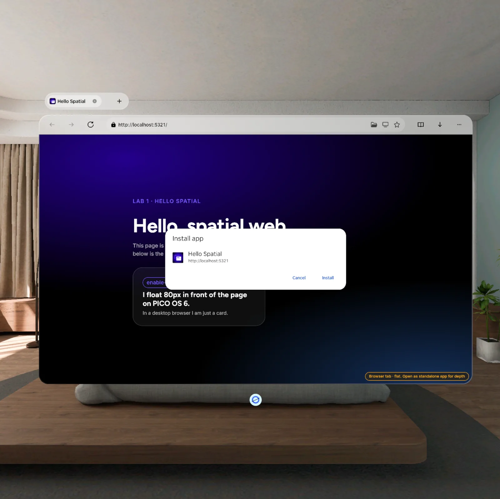
*PICO OS 6 emulator, shown with PICO's clearance for this workshop*

> **Speaker notes:** Source: labs/SPATIAL-CRACK.md (VERIFIED on the OS 6.0.0 emulator, 2026-09-24). A browser tab is never spatial: only the installed Web App's user agent contains WebSpatial/, and the SDK checks for exactly that string. Install creates a real Android package (com.picoxr.webapp.localhost.*) that survives an emulator restart. Changed the manifest? The installed app keeps the old one: `adb -s emulator-5554 shell pm list packages picoxr.webapp`, `adb uninstall <pkg>`, install again. Code changes hot-reload as usual. The emulator labels its actions "Install app" and "Open as Web App"; PICO's docs call the button "Open as standalone app"; webspatial.dev says "Run as a standalone app". After an emulator restart, re-run `node setup/launch.mjs <n>` to restore the adb reverse mapping.

## Proof it's real depth {#L1-s13}

*id: L1-s13 · level: 1 · step: 13 · kind: concept*

Same DOM. Only --xr-back changed, from 80 to 400.

A flat element can't leave its window. That card is a real plane in front of the page.

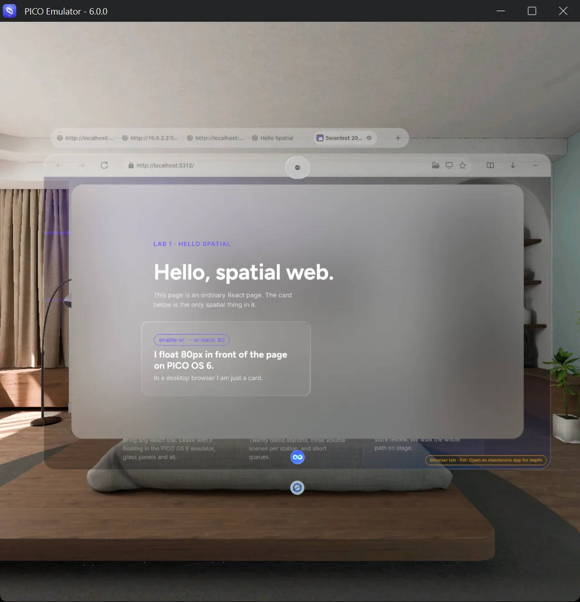
*PICO OS 6 emulator, shown with PICO's clearance for this workshop*

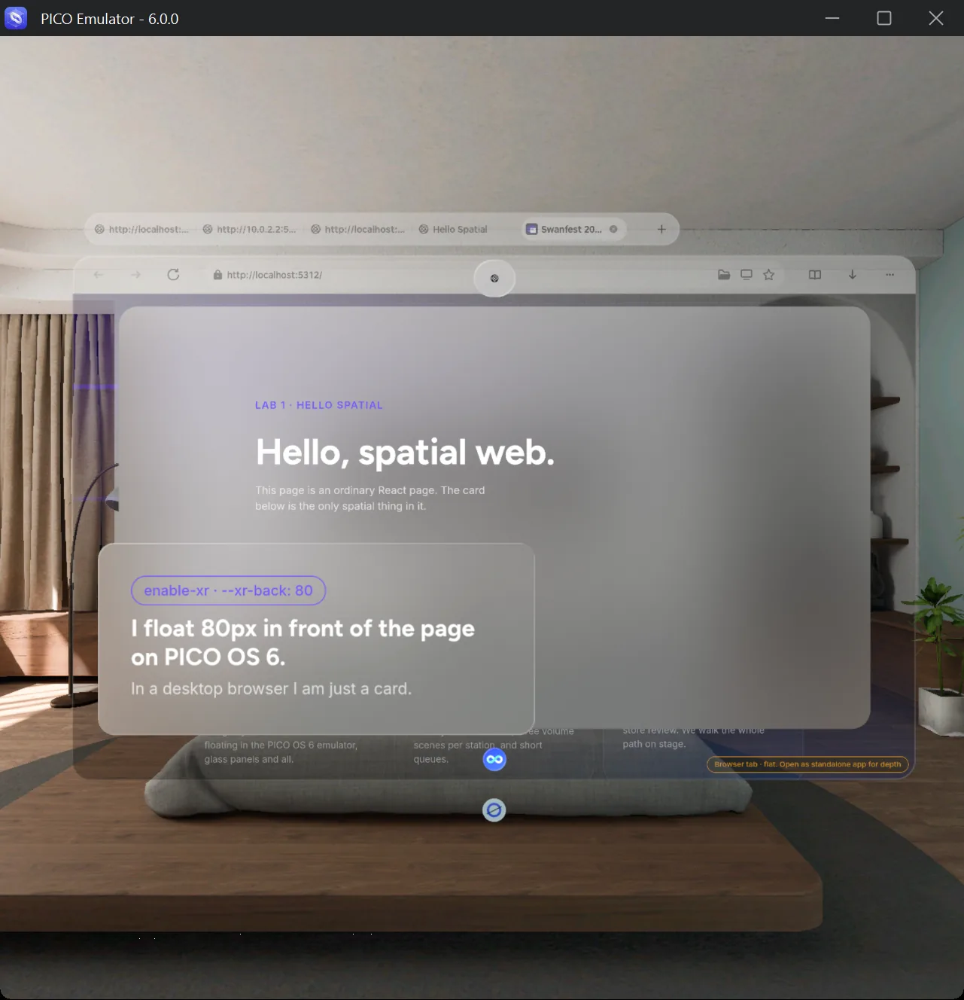
*PICO OS 6 emulator, shown with PICO's clearance for this workshop*

> **Speaker notes:** Source: labs/SPATIAL-CRACK.md (VERIFIED on the OS 6.0.0 emulator, 2026-09-24). The value was changed live over CDP from 80 to 400; the card went from about 374 to 580 px wide on screen. Each lifted element is its own child document (?command=createSpatialized2DElement). Proof from an agent: navigator.userAgent contains WebSpatial/ and <html> has is-spatial.

## Prove the runtime loaded {#L1-s14}

*id: L1-s14 · level: 1 · step: 14 · kind: step*

**Do this:** Add a badge showing the display-mode and the user-agent markers, then read it in all three places.

Claude Code prompt:

```text
Add a small badge to the page that shows the display-mode (browser vs standalone/minimal-ui via matchMedia) and whether navigator.userAgent matches /PicoWebApp\// and /WebSpatial\//. Tell me what it should say in a desktop browser, in a PICO Browser tab, and after Open as standalone app.
```

You should see:

```text
Desktop browser: browser, no markers.
PICO Browser tab: still browser. That's why it's flat.
Installed Web App: standalone, and the UA contains PicoWebApp/<ver> and WebSpatial/<ver>.
```


*PICO OS 6 emulator, shown with PICO's clearance for this workshop*

> **Speaker notes:** Measured (labs/SPATIAL-CRACK.md): a tab reads ... PicoBrowser/5.0.0 Chrome/138 ...; the installed app reads ... PicoWebApp/0.4.0 (like PicoBrowser) Chrome/138 WebSpatial/1.5.0 .... If it doesn't work, the debugging prompt from L1.md walks the five checks in order: which tsconfig has "jsx", jsxImportSource, inside <SpatialBoot>, opened as standalone app, UA contains WebSpatial/.

## Checkpoint: Hello Spatial {#L1-s15}

*id: L1-s15 · level: 1 · step: 15 · kind: checkpoint*

You're done when the app is installed as a Web App and something floats.

- The app is installed as a Web App in the emulator (its own window, its own launcher tile).
- Your `enable-xr` paragraph is visibly in front of the page.
- The same page looks completely normal in desktop Chrome.
- You can name the three things that make a React app a WebSpatial app on PICO: `jsxImportSource`, `<SpatialBoot>`, a valid PWA manifest.

A normal-looking page in Chrome is not a bug. That's the fallback working.

## Lab p1: hello spatial {#L1-s16}

*id: L1-s16 · level: 1 · step: 16 · kind: lab*

Build it yourself from the start folder. The solution folder is there when you're stuck.

Each lab has `start/` (you edit this) and `solution/` (the answer). Install every lab's dependencies once, from the kit root:

```bash
npm run labs:install
```

Then start lab 1's dev server in the background and open it in the emulator, still from the kit root (p1 serves on port 5301):

```bash
node setup/launch.mjs 1 --serve
```

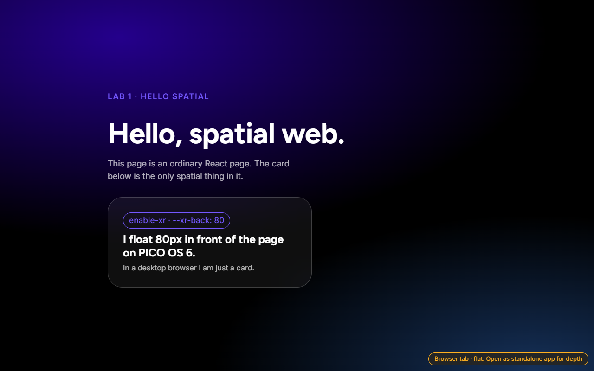
*desktop Chrome*

> **Speaker notes:** Labs pin @webspatial/react-sdk 2.0.0. Ports are 5301 to 5305 for start and 5311 to 5315 for solution (kit CLAUDE.md; each lab's package.json wins if they disagree).

## Spatialize a website {#L2-s1}

*id: L2-s1 · level: 2 · step: 1 · kind: concept*

The headline level. You don't rebuild the site. You pick a few elements and give them a Z axis.

- **Mark** the elements you want lifted with `enable-xr`.
- **Lift** them toward you with `--xr-back`.
- **Glass:** make the window transparent and give lifted elements a translucent material.
- **Split:** move secondary content into its own window with `initScene` + `window.open`.

X and Y stay plain CSS. Every Z property is ignored in an ordinary browser, so the desktop site doesn't change.


*desktop Chrome*

> **Speaker notes:** 45 minutes: 10 of concept, 35 of lab. Success is a before and an after screenshot. The mental model from L2.md is "2D containing 3D".

## Take the before picture {#L2-s2}

*id: L2-s2 · level: 2 · step: 2 · kind: step*

**Do this:** Serve the lab's starting site and open it in the emulator.

From the kit root (port 5302):

```bash
node setup/launch.mjs 2 --serve
```

You should see:

```text
The unchanged site loads in the emulator: one flat, opaque panel.
Screenshot it now. You'll compare against it in step 6.
```

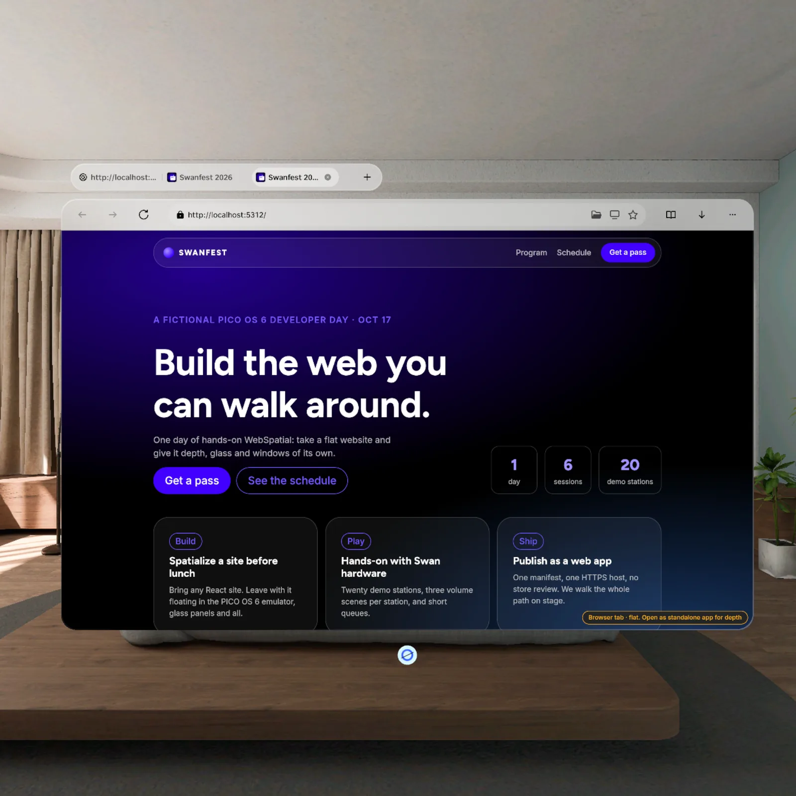
*PICO OS 6 emulator, shown with PICO's clearance for this workshop*

## Mark and lift {#L2-s3}

*id: L2-s3 · level: 2 · step: 3 · kind: step*

**Do this:** Ask Claude Code to spatialize the nav and the three feature cards.

Claude Code prompt:

```text
Here is an ordinary landing page. Spatialize it with WebSpatial without breaking the desktop version: mark the nav and the three feature cards enable-xr, give each card position: relative, --xr-back: 40 and --xr-background-material: translucent, set html { --xr-background-material: transparent } so the window glass disappears, and list every file you changed and why.
```

You should see:

```text
A short diff: enable-xr on the nav and three cards, a CSS block for .card, one rule on html, and a list of changed files with reasons.
```

Video: [The spatialized Swanfest site scrolling in desktop Chrome: on desktop it looks exactly like the original, which is the point](../assets/media/p2-clip-solution-scroll.webm)

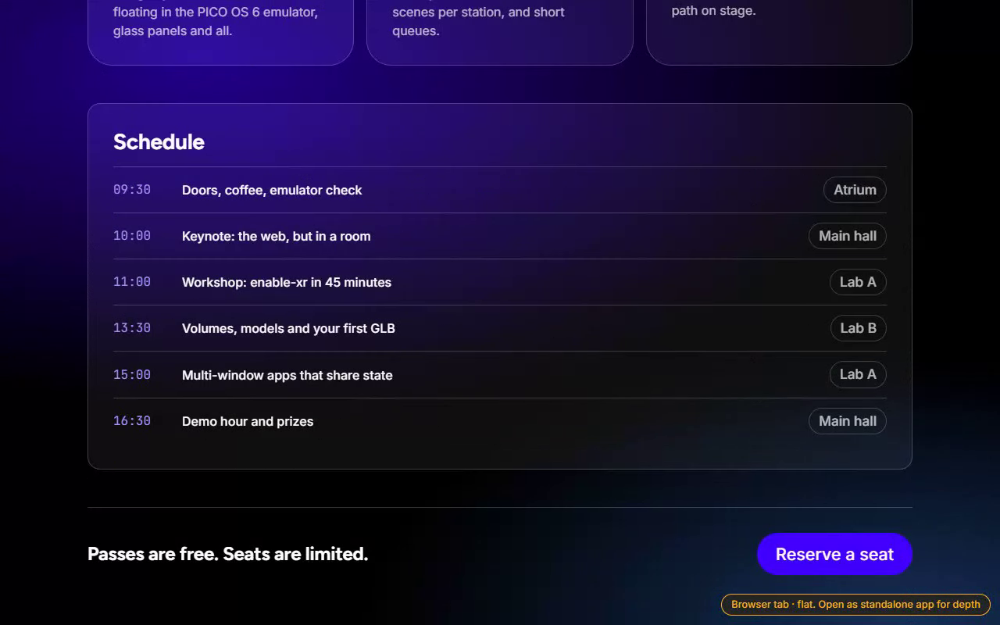
*desktop Chrome*

> **Speaker notes:** Don't mark everything: each enable-xr element is a separate native plane. If a parent's children come and go and shift a lifted child, put enable-xr-monitor on the parent.

## Read what --xr-back does {#L2-s4}

*id: L2-s4 · level: 2 · step: 4 · kind: step*

**Do this:** Check the card CSS against the three rules.

```tsx
.card {
  position: relative;   /* required: relative, absolute or fixed */
  --xr-back: 40;        /* px only, one decimal allowed */
}
```

- It's an inset like `top`, but on Z: the distance to the plane behind the element.
- **Don't nest `enable-xr` inside `enable-xr`.** On PICO OS 6.0.0 the nested one never rendered. Lift one or the other.
- Units are **px**, not metres. `"0.1m"` is not valid here.

You should see:

```text
If a card doesn't move: it's missing enable-xr, or it has no position.
```

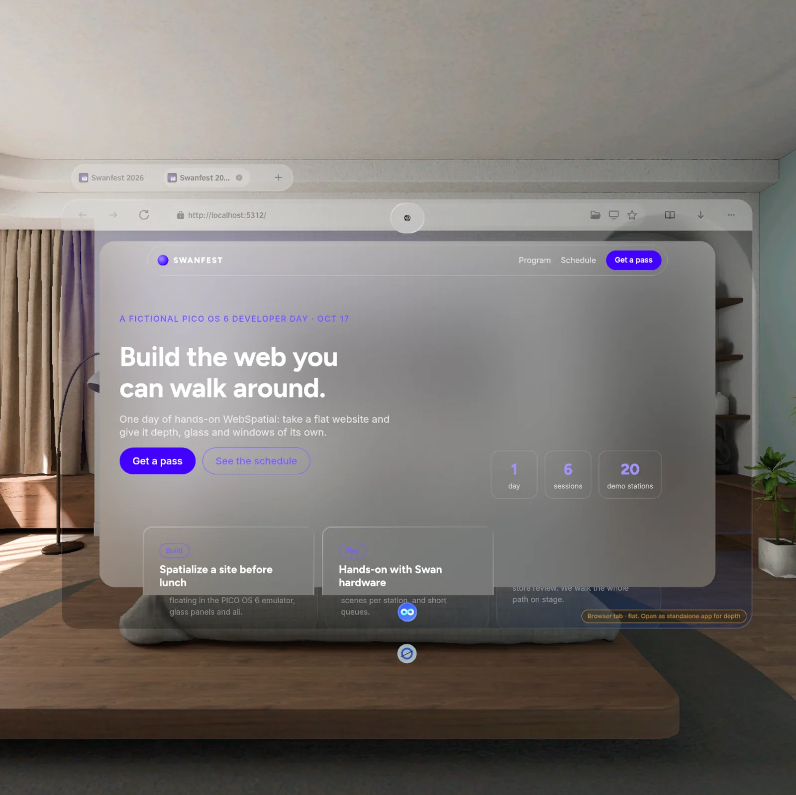
*PICO OS 6 emulator, shown with PICO's clearance for this workshop*

## Make the glass show through {#L2-s5}

*id: L2-s5 · level: 2 · step: 5 · kind: step*

**Do this:** Clear any background you paint over the glass, in spatial mode only.

```tsx
html  { --xr-background-material: transparent; }  /* the window */
.card { --xr-background-material: translucent; }  /* a lifted element */
```

Only `translucent`, `transparent` and `none` exist. Solid panel? Your own background covers the glass:

Claude Code prompt:

```text
My cards are lifted but show a solid white panel instead of glass. Find every CSS rule that paints a background under or on .card, and make them transparent only when navigator.userAgent matches /WebSpatial\//. Show me the diff.
```


*PICO OS 6 emulator, shown with PICO's clearance for this workshop*

> **Speaker notes:** The screenshot is lab p2 installed as a Web App on the OS 6.0.0 emulator (21-lab2-web-app-spatial): that is what translucent looks like there.

## Split off a second window {#L2-s6}

*id: L2-s6 · level: 2 · step: 6 · kind: step*

**Do this:** Open a details window from the Learn more button.

Claude Code prompt:

```text
Add a second window scene called 'details' with initScene (defaultSize 480 x 600), registered in <SpatialBoot onReady={registerScenes}> (not at module load), open it from the Learn more button with window.open('/?scene=details', 'details'), route ?scene=details to a Details component in main.tsx, and make sure it still opens as a normal tab in a desktop browser.
```

```tsx
// register after boot, or it's a no-op
const registerScenes = () =>
  initScene('details', prev => ({
    ...prev,
    defaultSize: { width: 480, height: 600 },
  }), { type: 'window' })

<SpatialBoot onReady={registerScenes}>

// on click; 2nd arg = scene name
window.open('/?scene=details', 'details')
```

You should see:

```text
Learn more opens a second window (the OS may size it like the main window). In desktop Chrome it opens a tab.
```

> **Speaker notes:** In a second window, don't wrap the page in enable-xr; the window is already glass. Keep floating panels small and few. initScene must run before window.open, and after boot. VERIFIED (assets/emulator/WALKTHROUGH.md): in SDK 2.0, initScene() does nothing until <SpatialBoot> has finished. It returns undefined and throws nothing, so a call at the top of main.tsx is lost: window.open gets the default config and a type: 'volume' scene opens as a flat 1280x720 window. Register scenes from <SpatialBoot onReady={...}>. The name must match the second argument. The OS treats defaultSize as a request.

## Take the after picture {#L2-s7}

*id: L2-s7 · level: 2 · step: 7 · kind: step*

**Do this:** Capture the spatialized site and compare it with the before.

Claude Code prompt:

```text
Take a before and after screenshot in the emulator with pico-cli capture screenshot and describe exactly which elements now float and which stayed flat. Then open the page in desktop Chrome and confirm nothing broke.
```

```bash
pico-cli capture screenshot -o shots/spatialized.png
```

You should see:

```text
Nav and cards float on glass in front of a clear window. Everything else stayed flat. Desktop Chrome looks the same as before.
```


*PICO OS 6 emulator, shown with PICO's clearance for this workshop*

## Read the runtime's logs {#L2-s8}

*id: L2-s8 · level: 2 · step: 8 · kind: step*

**Do this:** Pull recent log lines that mention WebSpatial.

```bash
pico-cli log -e webspatial -n 200
```

You should see:

```text
The last 200 logcat lines that match "webspatial". Errors here explain a card that won't lift or a window that won't open.
```

> **Speaker notes:** The kit's `node setup/snap.mjs` takes a burst and keeps the least-black frame; a single emulator capture is often mostly black while the page renders fine. -e is a regex filter on the message, -n the number of recent lines (pico-cli log --help).

## Checkpoint: spatialized {#L2-s9}

*id: L2-s9 · level: 2 · step: 9 · kind: checkpoint*

The headline result. Show your neighbour both screenshots.

- You have a before and an after screenshot from the emulator.
- The nav and the cards float; the window glass is clear.
- The details window opens from Learn more.
- The desktop build is unchanged.

Two questions for the room: which values does `--xr-background-material` accept? What's the difference between `--xr-back: 40` and `transform: translateZ(40px)`?

> **Speaker notes:** Answers from L2.md: translucent, transparent, none, with transparent on html to remove the window. --xr-back moves the Z layout position, and children and event coordinates follow it; translateZ only moves where it's drawn.

## Lab p2: spatialize a site {#L2-s10}

*id: L2-s10 · level: 2 · step: 10 · kind: lab*

The headline lab. Mark, lift, glass, split, on a real landing page.

Edit `labs/p2-spatialize-site/start`, serve it with `npm run dev:xr` on port 5302, and open it with `node setup/launch.mjs 2`. `launch.mjs` wraps `pico-cli web launch` and refuses any target that isn't an emulator. Keep the desktop version working the whole way through.

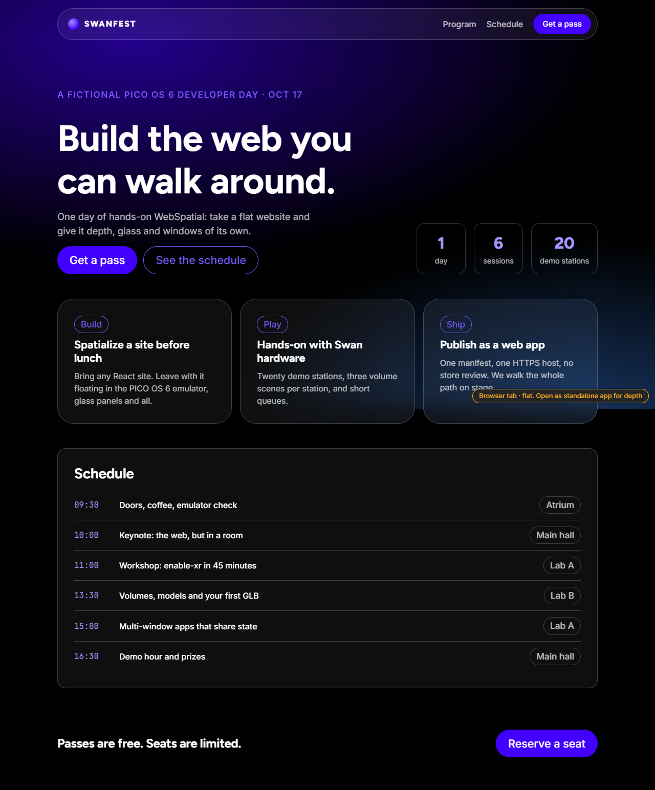
*desktop Chrome*

## 3D and volumes {#L3-s1}

*id: L3-s1 · level: 3 · step: 1 · kind: concept*

WebSpatial puts 3D inside a 2D layout. A 3D container takes part in CSS layout as a flat plane, and its content lives in a box in front of it.

- **`<Model>`** shows a prebuilt GLB or USDZ file. Its API follows the web `<model>` element.
- **`<Reality>`** composes a scene from primitives, materials and model entities as React components.
- **Volume scene:** a window that behaves like a physical object, sized in metres.
- **Units flip:** `--xr-depth` is px, entity sizes and positions are metres, rotation is radians.

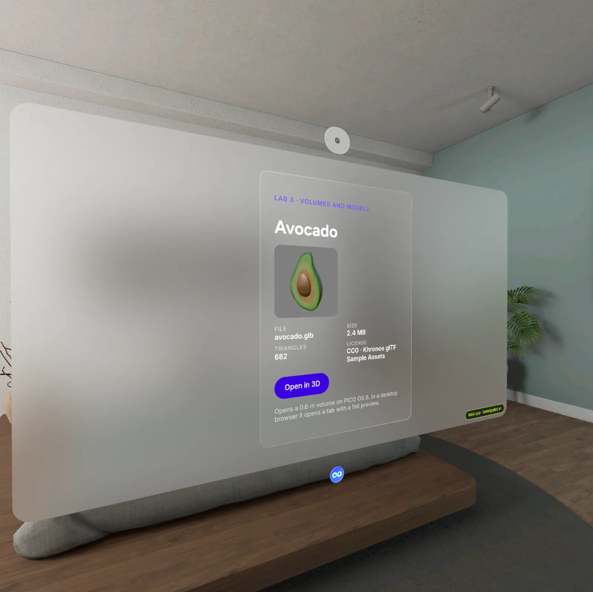
*PICO OS 6 emulator, shown with PICO's clearance for this workshop*

> **Speaker notes:** 30 minutes. Teach <Model> first; <Reality> is optional stretch (SYLLABUS run of show). Unverified per L3.md: that <Model> and <Reality> render in PICO OS 6's runtime on the emulator. Say so.

## Open a volume with a model {#L3-s2}

*id: L3-s2 · level: 3 · step: 2 · kind: step*

**Do this:** Ask Claude Code for a 'viewer' volume that shows your GLB.

Claude Code prompt:

```text
Add a volume scene called 'viewer' (defaultSize 0.6m on all three axes, registered in <SpatialBoot onReady={registerScenes}>, not at module load) that shows public/model.glb with <Model enable-xr> plus a poster image, onLoad and onError handlers. Open it from a button on the main page with window.open('/?scene=viewer', 'viewer'). In a desktop browser the button should still open a normal tab.
```

```tsx
// call from <SpatialBoot onReady={registerScenes}>
export function registerScenes() {
  initScene('viewer', prev => ({
    ...prev,
    defaultSize: {
      width: '0.6m', height: '0.6m', depth: '0.6m',
    },
  }), { type: 'volume' })  // 3rd argument
}
```

> **Speaker notes:** Inside a volume, keep 2D UI flat; put the depth in the 3D content: an enable-xr panel inside a volume failed to create on PICO OS 6.0.0 (createSpatialized2DElement failed). VERIFIED (assets/emulator/WALKTHROUGH.md): in SDK 2.0, initScene() does nothing until <SpatialBoot> has finished. It returns undefined and throws nothing, so a call at the top of main.tsx is lost: window.open gets the default config and a type: 'volume' scene opens as a flat 1280x720 window. Register scenes from <SpatialBoot onReady={...}>. Without enable-xr, <Model> is the flat web <model> element. The model fits the container's width and height: size the container, not the model.

## Launch and record it {#L3-s3}

*id: L3-s3 · level: 3 · step: 3 · kind: step*

**Do this:** Serve lab p3, open it in the emulator and record 15 seconds of the volume.

```bash
node setup/launch.mjs 3 --serve
```

```bash
pico-cli capture record -t 15 -o shots/volume.mp4
```

You should see:

```text
A 15 second clip in shots/volume.mp4 with the viewer volume open and the model inside it.
```

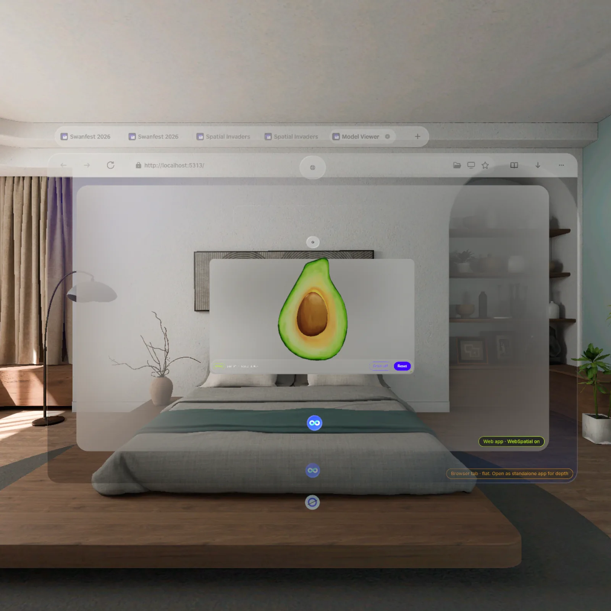
*PICO OS 6 emulator, shown with PICO's clearance for this workshop*

## Make it respond to a drag {#L3-s4}

*id: L3-s4 · level: 3 · step: 4 · kind: step*

**Do this:** Wire spatial drag and tap onto the model.

Claude Code prompt:

```text
Make the model follow a spatial drag: on onSpatialDragStart remember the start, on onSpatialDrag apply translationX/Y/Z (px) through a style transform, and on onSpatialTap reset. Tell me which event carries which field and what I have to test by hand because adb cannot inject a spatial ray.
```

- `onSpatialTap`: `offsetX/Y/Z` and `clientX/Y/Z`
- `onSpatialDrag`: `translationX/Y/Z`, px from the start
- `onSpatialRotate`: `quaternion` · `onSpatialMagnify`: `magnification`

You should see:

```text
Each handler logs to the console, so you can prove it fired.
```

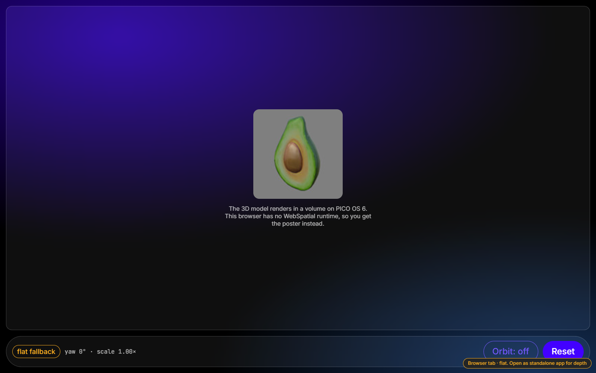
*desktop Chrome*

> **Speaker notes:** adb shell input injects a 2D touch on the emulator's flat display. It never ray-casts into 3D content. Test gestures by hand with the emulator window's pointer.

## Check the warnings {#L3-s5}

*id: L3-s5 · level: 3 · step: 5 · kind: step*

**Do this:** Read recent log lines at warning level or above.

```bash
pico-cli log -l W -n 200
```

You should see:

```text
The last 200 lines at W, E or F. A model that failed to load shows up here, and your onError handler fires.
```

## Keep the model light {#L3-s6}

*id: L3-s6 · level: 3 · step: 6 · kind: step*

**Do this:** Ask Claude Code to measure the GLB and compress it if it's heavy.

Claude Code prompt:

```text
Check the GLB file size and triangle count with gltf-transform inspect and tell me if it is too heavy for a headset. If it is, give me the gltf-transform command to simplify and compress it, run it, and compare before and after.
```

```bash
npx @gltf-transform/cli inspect
```

You should see:

```text
A size and triangle count for the file, and a before/after comparison if Claude compressed it.
```

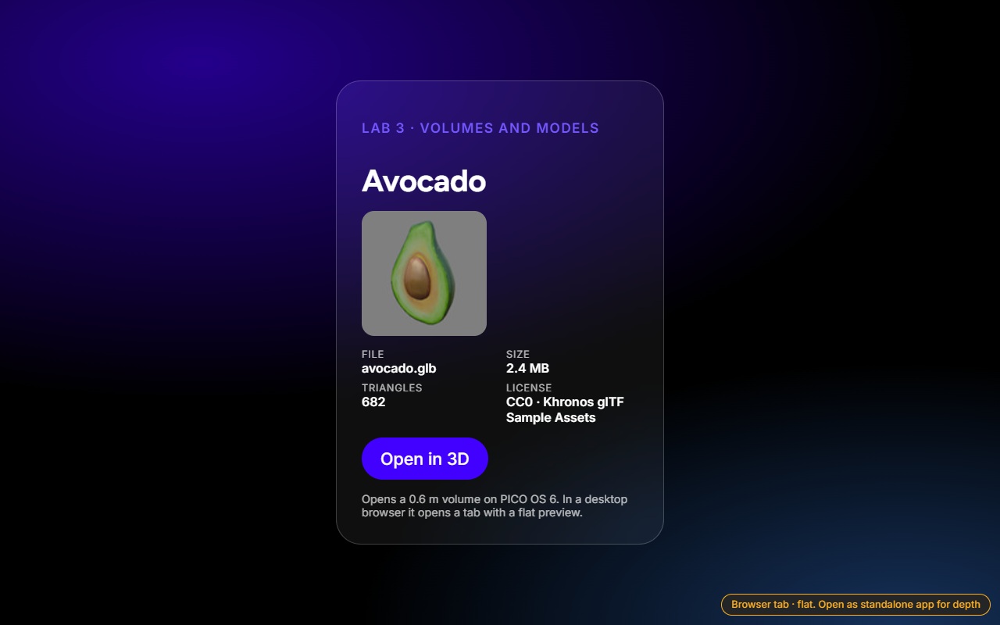
*desktop Chrome*

> **Speaker notes:** Claude adds the file path to the inspect command. A 40 MB GLB has to load over a headset's network and GPU.

## Stretch: build with primitives {#L3-s7}

*id: L3-s7 · level: 3 · step: 7 · kind: step*

**Do this:** Build a trophy from primitives with no model file at all.

Claude Code prompt:

```text
Without any external model, build a trophy in a <Reality> from Box, Cylinder and Sphere with one unlit gold Material, slowly rotating on Y via requestAnimationFrame. Gate it with WebSpatialRuntime.supports('Reality') and render a flat  fallback otherwise.
```

You should see:

```text
A gold trophy turning slowly in the volume. In desktop Chrome, the flat image.
```

> **Speaker notes:** Materials go outside <World>, entities inside. A <Box width={200}> is a 200 metre box. No CSS on entities; animate state in requestAnimationFrame.

## Checkpoint: 3D and volumes {#L3-s8}

*id: L3-s8 · level: 3 · step: 8 · kind: checkpoint*

You're done when a volume opens with your model or scene, and a log line proves a gesture fired.

- A volume opens with a model or a primitive scene.
- At least one spatial gesture fired, proved by a console log line.
- The page still works in desktop Chrome, with a flat fallback.

Quick check: how big is a `<Box width={0.2}>`? (20 cm: entity lengths are metres.)

## Lab p3: volume model {#L3-s9}

*id: L3-s9 · level: 3 · step: 9 · kind: lab*

A model in a volume, a gesture that moves it, and a fallback for everyone else.

Start from the lab's start folder. Log every gesture handler so you can prove it fired.

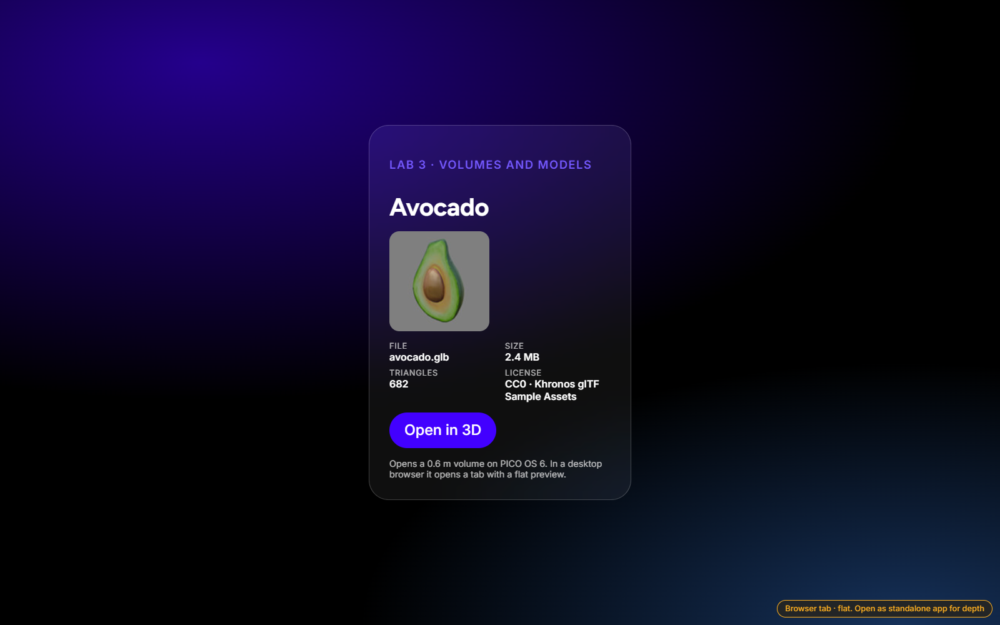
*desktop Chrome*

## Spatial Invaders: depth as gameplay {#L4-s1}

*id: L4-s1 · level: 4 · step: 1 · kind: concept*

So far depth has been decoration. Here it carries meaning: a complete, flat Space Invaders game where Z tells part of the story.

- **Rows stand in terraces,** back rows deepest.
- **The formation comes toward you** as it descends.
- **Your shots fly away from you;** enemy shots fly at you.
- **A hit row flinches forward** before the invader vanishes.
- **A HUD window** and a **hall of fame** window, synced over `BroadcastChannel`.

Video: [Spatial Invaders in desktop Chrome: start, strafe and fire (6.5 s, the flat fallback)](../assets/media/p4-clip-gameplay.webm)

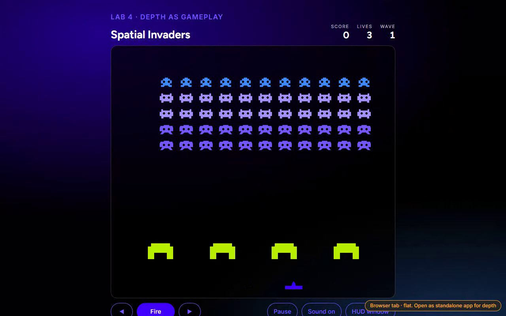
*desktop Chrome*

> **Speaker notes:** The showpiece. Source: labs/p4-space-invaders/README.md (final). start/ is solution/ with every SPATIAL line removed, so `git diff --no-index labs/p4-space-invaders/start/src labs/p4-space-invaders/solution/src` is the whole lesson. Collisions never read Z: the game plays the same on a laptop. The screenshot is desktop Chrome (flat); the corner badge says "Browser tab · flat".

## Where everything sits in Z {#L4-s2}

*id: L4-s2 · level: 4 · step: 2 · kind: concept*

**Diagram: Side view of Spatial Invaders: five row planes at stepped depths that come forward together, the shield line and the ship.** Side view with the window's glass on the left at depth 0 and the player on the right; --xr-back grows toward the player. No spatial element sits inside another: each of the five rows is its own top-level plane at an absolute depth of 5 plus 0.08 times the formation's Y, plus row times 20, so row 0 (the top row) is deepest and all five come forward together as the formation descends. A hit row flinches 24 px forward. The shield line is one plane at 100 and the ship is at 120, always the closest. Player shots travel from 120 back to the front row; enemy shots travel from the firing row toward the ship. The Fire and arrow buttons are flat on the window.

Each row writes its **absolute** depth: `(5 + y × 0.08) + row × 20 + flinch`. Nothing is nested. At wave 1 (y = 80) the front row is 11.4 + 80 = **91.4 px**. **Keep depths modest:** planes lifted far toward you, low in the window, fall below it.

> **Speaker notes:** Start y is 80 (solution/src/constants.ts START_Y), per wave +14 up to wave 5. Numbers from labs/p4-space-invaders/README.md "The depth map (solution)" and solution/src/depth.ts: rows ROW_STEP 20, formation 5 + y × 0.08, shields 100, ship 120 (the deepest the front row ever reaches is 5 + 412 × 0.08 + 80 = 118), flinch 24 with POP_DECAY 0.85 (about 200 ms), overlay card 150 while shown, buttons flat. The first version used ship 260, shields 210 and 30 px steps, and in the emulator's default view the ship and buttons projected below the window's bottom edge. All values are px, one decimal, never negative, written through refs by writeBack(el, z), which skips unchanged values.

## The layer budget: 11 planes, not 230+ {#L4-s3}

*id: L4-s3 · level: 4 · step: 3 · kind: concept*

Each enable-xr element is its own native plane. Spatialize containers, not sprites.

| Layer | Planes | Depth (px) |
|---|---|---|
| Rows 0 to 4 | 5 | `(5 + y × 0.08) + row × 20` |
| Invaders (55) | **0** | ride on their row |
| Shields | 1 | 100: four bunkers on one plane |
| Ship | 1 | 120, always the closest |
| Shots, bombs | 4, pooled | travel in Z |
| ◀ Fire ▶ | **0** | flat on the window; pinch = click |
| Playfield | **0** | plain div: no nesting |

**11 planes** (12 with the overlay card) vs **230+** if every sprite were spatial.

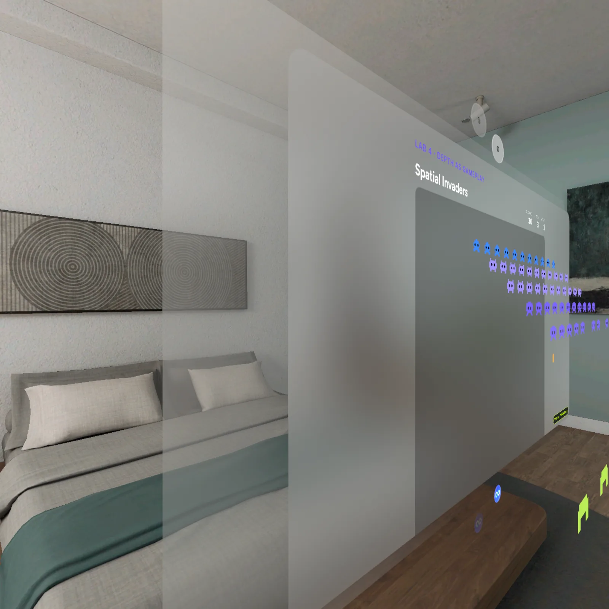
*PICO OS 6 emulator, shown with PICO's clearance for this workshop*

> **Speaker notes:** The key lesson of the level. The docs publish no per-scene plane limit, so treat roughly 15 as a budget habit, not a hard number; measure it with pico-cli perf in L5. The UFO stays on the page plane plane (cosmetic, 0 planes). Unverified on the emulator: frame rate with per-frame --xr-back writes.

## Wire WebSpatial {#L4-s4}

*id: L4-s4 · level: 4 · step: 4 · kind: step*

**Do this:** Play a round flat first, then wire the same four pieces as p1 and p2.

```bash
node setup/launch.mjs 4 --serve
```

```bash
npm i @webspatial/react-sdk@2.0.0 @webspatial/core-sdk@2.0.0 --save-exact
```

- `jsxImportSource` in `tsconfig.json` **and** `react({...})` in `vite.config.ts`
- `<SpatialBoot>` around `<Game />` in `main.tsx`
- The manifest is already there: `xr_main_scene` sizes the game window 900 × 1000

You should see:

```text
http://localhost:5304/ plays the flat game. Press Enter to start. Then make the window glass. The playfield stays a plain div: nothing spatial nests inside anything spatial.
```

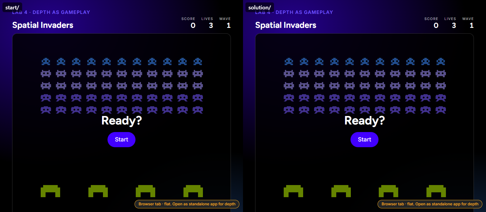
*desktop Chrome*

> **Speaker notes:** Controls: ← → move, Space fire, Enter start, P pause, M sound. The on-screen buttons work with mouse, touch or a pinch. All art is CSS and all sound is WebAudio.

## Rows get depth {#L4-s5}

*id: L4-s5 · level: 4 · step: 5 · kind: step*

**Do this:** One spatial layer per row, not per sprite.

Claude Code prompt:

```text
Spatialize this Space Invaders game with one spatial layer per ROW, not per sprite: make each .row enable-xr (no spatial parent: never nest enable-xr inside enable-xr, it does not render on PICO OS 6.0.0) and write each row's --xr-back = row * 20 (row 0, the top/back row, deepest) through its ref. Leave every invader a plain div. Put the depth constants in src/depth.ts with a writeBack(el, z) helper that rounds to one decimal and skips unchanged values, and make the loop's transform/visibility writes skip unchanged values too. Then count the enable-xr elements.
```

```tsx
// absolute depth: no spatial parent
export const rowWorldZ = (y: number, row: number, pop = 0) =>
  formationZ(y) + row * ROW_STEP + pop
```

You should see:

```text
No visible change on desktop. In DevTools each .row's inline style shows --xr-back 20 px apart, row 0 deepest.
```

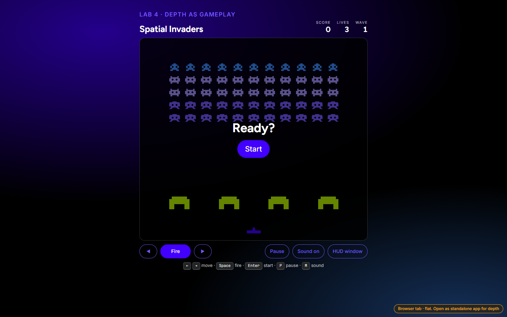
*desktop Chrome*

## Depth tied to descent {#L4-s6}

*id: L4-s6 · level: 4 · step: 6 · kind: step*

**Do this:** Make the threat physically approach, written from the game loop.

Claude Code prompt:

```text
Tie the formation's depth to its descent: each row's --xr-back = (5 + y * 0.08) + row * 20 + flinch, written from the requestAnimationFrame loop through the row's ref with writeBack, so it only writes when the rounded value changes. No CSS transitions on spatial elements. Show me the loop code you changed.
```

```tsx
rowRefs.current.forEach((el, r) =>   // SPATIAL: every row comes toward you as it descends
  writeBack(el, rowWorldZ(w.fy, r, w.pops[r])))
```

You should see:

```text
At the start (y = 80) the rows read 11.4 / 31.4 / 51.4 / 71.4 / 91.4; near the shields (y ≈ 400) each is about 25 px further forward.
```

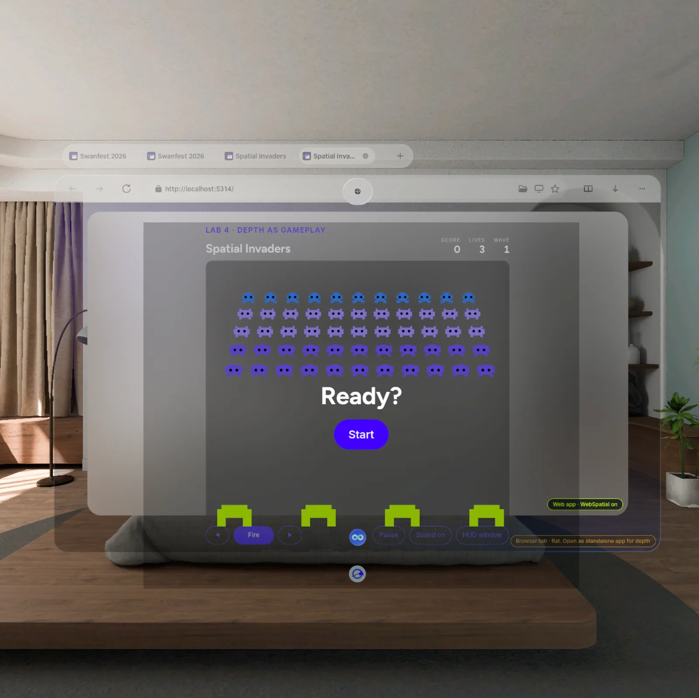
*PICO OS 6 emulator, shown with PICO's clearance for this workshop*

> **Speaker notes:** Spatialized elements don't support CSS animations or transitions, so depth changes are writes from the rAF loop through refs, never document.querySelector.

## Shots travel in Z; hits flinch {#L4-s7}

*id: L4-s7 · level: 4 · step: 7 · kind: step*

**Do this:** Give the ship, shields, shots and bombs their depths.

Claude Code prompt:

```text
Make the ship (120) and the shield line (100) enable-xr at fixed depths, and the 2 pooled shots and 2 pooled bombs enable-xr. Player shots: lerp --xr-back from the ship's depth to the front row's absolute depth (formation + row) as they rise. Enemy shots: lerp from the depth of the row that fired them to the ship's depth as they fall. Keep collision detection 2D. On a hit, pop that row forward by 24px and decay it back over about 200ms in the loop, while the invader flashes before it vanishes.
```

You should see:

```text
11 planes, matching the layer budget. Your shots recede, enemy shots approach, and a hit row flinches.
```

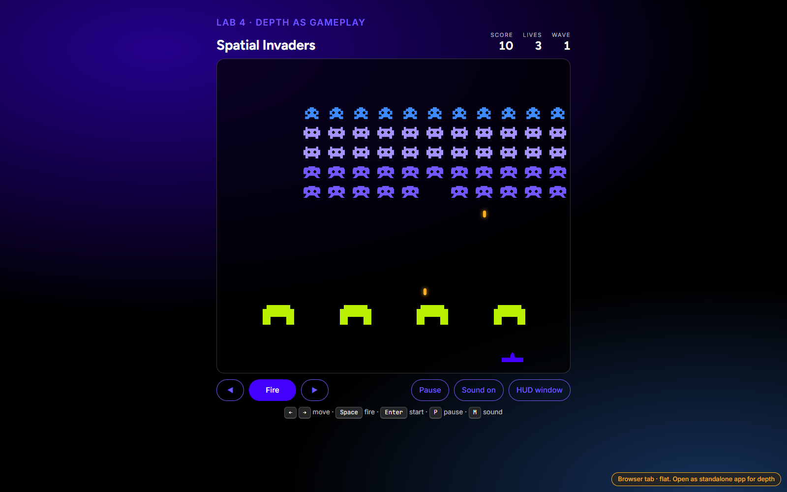
*desktop Chrome*

> **Speaker notes:** The on-screen ◀ Fire ▶ buttons use plain onClick: a pinch on a spatial button arrives as a click. Never put onSpatialTap on a <button>, even gated by useSpatialReady(): inside the PICO runtime it logs "Unknown event handler property onSpatialTap". Spatial events are for <Model>, <Reality> entities and enable-xr divs.

## The HUD window {#L4-s8}

*id: L4-s8 · level: 4 · step: 8 · kind: step*

**Do this:** Give score, lives and wave their own window, kept in sync.

Claude Code prompt:

```text
Add a HUD window: register initScene('hud', cfg => ({...cfg, defaultSize: {width: 360, height: 480}}), { type: 'window' }) in src/scenes.ts, open it with window.open('/?scene=hud', 'hud') from a "HUD window" button, call registerScenes from <SpatialBoot onReady={registerScenes}> (initScene before boot is a silent no-op in SDK 2.0), route ?scene=hud in main.tsx, and sync score, lives, wave and status over a BroadcastChannel named 'invaders'. The game is authoritative, broadcasts only when HUD state changes, answers 'hello', and applies 'intent' messages (pause, restart) from the HUD. Prove it in desktop Chrome, including a HUD opened mid-game and one closed and reopened.
```

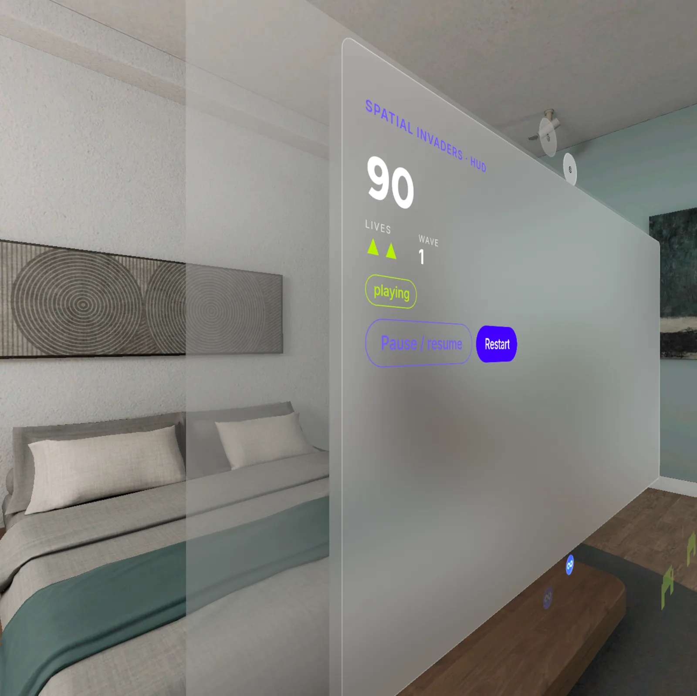
*PICO OS 6 emulator, shown with PICO's clearance for this workshop*

> **Speaker notes:** In a second window, don't wrap the page in enable-xr; the window is already glass. Keep floating panels small and few. Files in solution/src: bus.ts (message types + channel), scenes.ts (initScene + openScene + router), Hud.tsx (display, hello on mount, intent buttons). The HUD's Pause sends an intent; only the game changes state. The second scene, 'halloffame' (420x560), opens at game over. The game window's own size comes from xr_main_scene in the manifest (900 x 1000), not initScene.

## Gotcha: a message posted just before window.open can vanish {#L4-s9}

*id: L4-s9 · level: 4 · step: 9 · kind: step*

**Do this:** Post first, then open the new window on a later task.

```tsx
// broken: same task, the HUD misses it
bus.post({ type: 'gameover', score, wave })
openScene('halloffame')

// fixed: open the new window on a later task
bus.post({ type: 'gameover', score, wave })
window.setTimeout(() => openScene('halloffame'), 100)
```

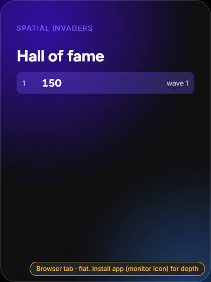
*desktop Chrome*

> **Speaker notes:** In desktop Chrome, a BroadcastChannel message posted in the same task that opens a brand-new window was dropped for the windows already listening. The lab's automated check reproduces it: with the first form, the HUD never shows "Game over". Measured 2026-09-24 in Chrome with SDK 2.0.0; not yet measured inside PICO's web-app runtime, so keep the deferral either way.

## In the emulator {#L4-s10}

*id: L4-s10 · level: 4 · step: 10 · kind: step*

**Do this:** Launch it, install it as a Web App, open the HUD, and capture the proof.

```bash
node setup/launch.mjs 4
```

Claude Code prompt:

```text
Launch the game in the PICO emulator with node setup/launch.mjs 4, install it as a web app, open the HUD, take a burst of screenshots with node setup/snap.mjs, then close the HUD and reopen it. Tell me whether it showed the right score immediately after reopening.
```

You should see:

```text
Installed as a Web App (monitor icon, titled Install app, just left of the star → Install; wait up to 60 s; if the panels are still missing, close and reopen the app once): stepped rows, an approaching formation, flinching hits, shots flying in and out of depth. The corner badge reads "Web app · WebSpatial on".
```


*PICO OS 6 emulator, shown with PICO's clearance for this workshop*

> **Speaker notes:** By hand: npm run dev:xr in the lab folder, adb reverse tcp:5314 tcp:5314 (solution) or 5304 (start), then http://localhost:<port>/ in the PICO Browser. 10.0.2.2 loads but was not a secure context in our test (no install); use localhost. Glass still empty after 60 s with createSpatialized2DElement failed in the console? Close and reopen the app (the solution auto-reloads once). Keep depths modest: a plane lifted far toward you, low in the window, projects below the window's bottom edge in the default view (the ship vanished at 260; it now sits at 120). For a clip: pico-cli capture record -t 15 -o captures/invaders.mp4.

## Checkpoint: invaders in depth {#L4-s11}

*id: L4-s11 · level: 4 · step: 11 · kind: checkpoint*

You're done when depth tells the story and the windows stay in sync.

- You can state the plane count (**11**, 12 with the overlay), why invaders aren't planes, and why nothing is nested.
- DevTools: each `.row`'s `--xr-back` rises as the formation descends, 20 px apart.
- The HUD opened mid-game shows the live score, its Pause works, it recovers after close + reopen, and it shows "Game over".
- Emulator (Web App): stepped rows, an approaching formation, flinching hits, shots in and out of depth.

## Lab p4: Spatial Invaders {#L4-s12}

*id: L4-s12 · level: 4 · step: 12 · kind: lab*

Rows in depth, a formation that advances in Z, shots both ways, a HUD and a hall of fame.

Edit `start/` (port 5304), never `solution/` (5314). The diff between them is the whole lesson:

Claude Code prompt:

```text
Run git diff --no-index labs/p4-space-invaders/start/src labs/p4-space-invaders/solution/src and walk me through every SPATIAL change in order: which elements became planes, what depth each gets from src/depth.ts, and why the invaders and shield blocks did not.
```

Video: [start/ and solution/ playing side by side in desktop Chrome: same game, the diff is depth](../assets/media/p4-clip-start-vs-solution.webm)

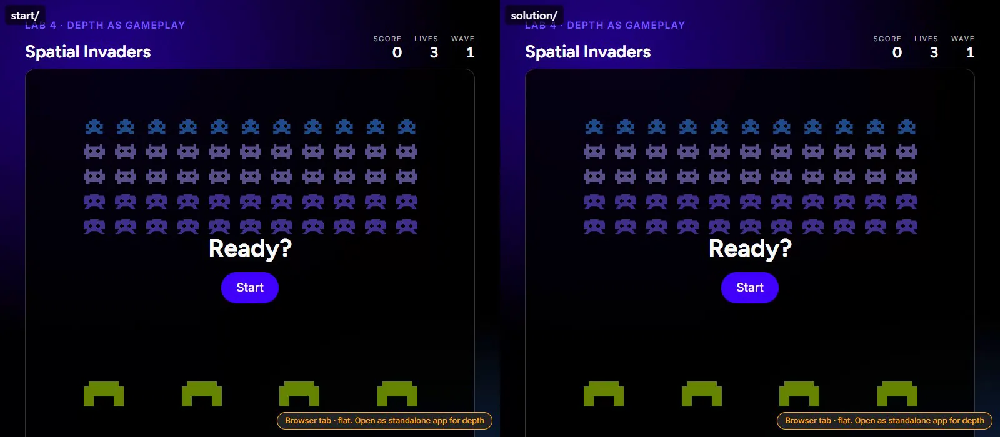
*desktop Chrome*

## Agentic expert: Claude Code runs the loop {#L5-s1}

*id: L5-s1 · level: 5 · step: 1 · kind: concept*

Every step you did by hand is a command, so an agent can run them. Your job is to hold it to evidence.

- **The loop:** edit, serve, `pico-cli web launch`, capture, `pico-cli log -l W`, judge against SPEC.md, repeat.
- **Evidence per claim:** a screenshot path, a log line or a DevTools read. "The code looks right" isn't evidence.
- **Bound it:** an iteration cap and a stopping condition.
- **Ground it:** PICO questions go through the `pico-dev-knowledge` MCP, with a cited source.

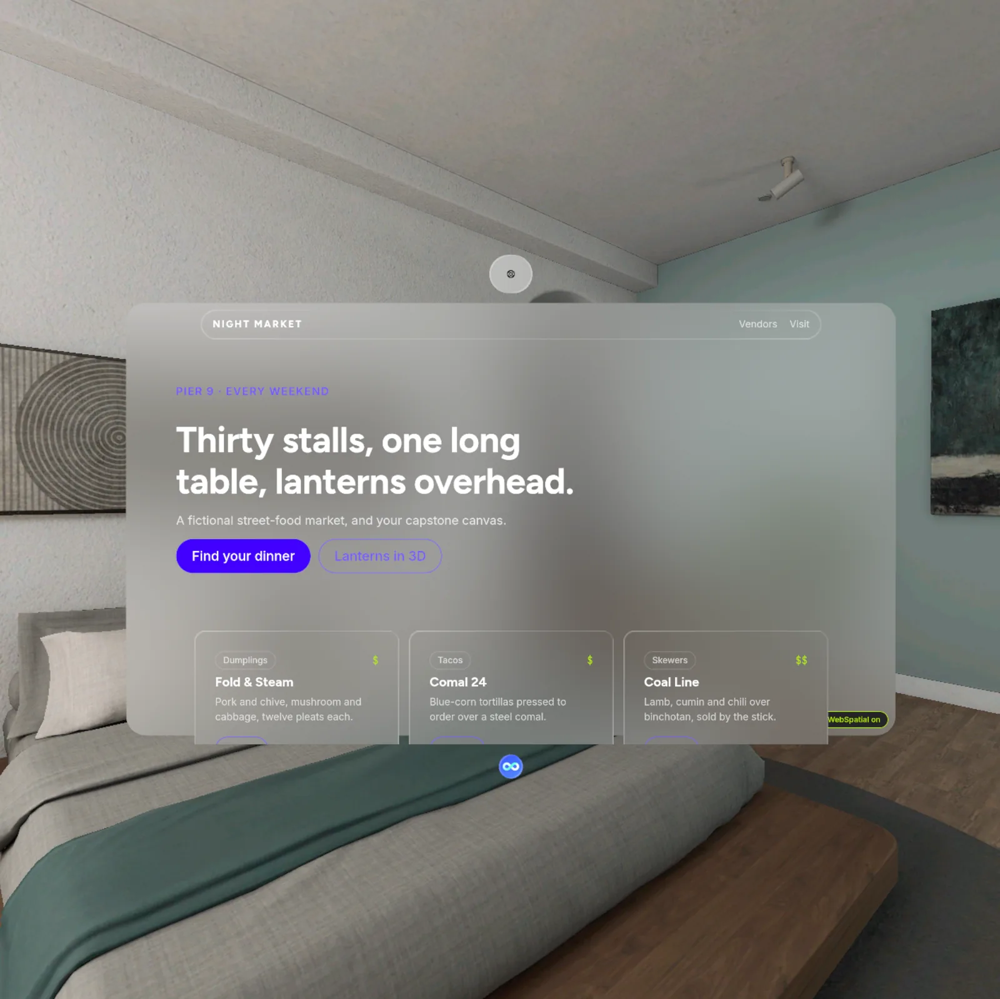
*PICO OS 6 emulator, shown with PICO's clearance for this workshop*

> **Speaker notes:** 25 minutes: 15 of demo on one attendee's site, 10 of capstone kickoff, then the capstone goes home. Emulator screenshots are sometimes partly black while the app renders fine: that's why the loop needs a cap, or the agent "fixes" an artefact for an hour.

## Check the agent layer {#L5-s2}

*id: L5-s2 · level: 5 · step: 2 · kind: step*

**Do this:** Confirm PICO's skills and knowledge base are installed and current.

```bash
pico-cli plugin doctor
```

```bash
pico-cli knowledge pull
```

You should see:

```text
plugin doctor reports the skills installed. knowledge pull updates the PICO docs graph behind the pico-dev-knowledge MCP.
```

> **Speaker notes:** For web work, the PICO skills that matter are pico-cli, pico-env-doctor, spatial-emulator-usage and spatial-app-performance-analysis. Most others target native Kotlin Spatial SDK apps.

## Docs for your agent, with one fix {#L5-s3}

*id: L5-s3 · level: 5 · step: 3 · kind: step*

**Do this:** In your own project, add WebSpatial's docs and agent memory, then pin SDK 2.0.

**Verified 2026-09-24:** adds WebSpatial docs + agent memory to a project. Its bundled docs predate SDK 2.0, so **don't run it inside the labs**. In your own project, run it, then add the second block below to `CLAUDE.md`.

```bash
npx @webspatial/starter ai
```

```text
SDK 2.0: wrap the app in <SpatialBoot>; labs/VERSIONS.md overrides .webspatial/docs
```

You should see:

```text
.webspatial/docs (54 files), .claude/ + a CLAUDE.md block, .codex/skills, an AGENTS.md block.
```

> **Speaker notes:** Verified 2026-09-24: adds WebSpatial docs + agent memory to a project. Its bundled docs predate SDK 2.0, so don't run it inside the labs; in your own project, run it and then add one line to CLAUDE.md: 'SDK 2.0: wrap the app in <SpatialBoot>; labs/VERSIONS.md overrides .webspatial/docs' It also adds a .git/info/exclude entry, and `npx @webspatial/starter` (the scaffolder) creates an SDK ^1.5.0 project (examples/README.md). Hazard: the starter's CLAUDE.md block tells the agent "local .webspatial/docs always wins", and those docs never mention <SpatialBoot>. In a 2.0 project that steers Claude away from <SpatialBoot>, which means back to flat pages. Run by the team lead on a scratch copy of lab p1: @webspatial/starter v0.1.0, published 2026-04-15, no install scripts.

## Hand over the whole loop {#L5-s4}

*id: L5-s4 · level: 5 · step: 4 · kind: step*

**Do this:** Give Claude Code a spec, a cap and a demand for evidence.

Claude Code prompt:

```text
Run the whole loop on this repo without asking me: start the dev server, launch it in the PICO emulator, screenshot every scene, read the last 200 log lines at warning or above, fix anything broken, and repeat until the screenshots match SPEC.md. Stop after 5 iterations either way and show me the evidence for each claim.
```

You should see:

```text
A report where each claim has a screenshot path or a log excerpt next to it, and a stop at 5 iterations or fewer.
```

Video: [The capstone solution, Night Market, scrolling in desktop Chrome: the kind of result the loop should produce and prove](../assets/media/p5-clip-night-market.webm)

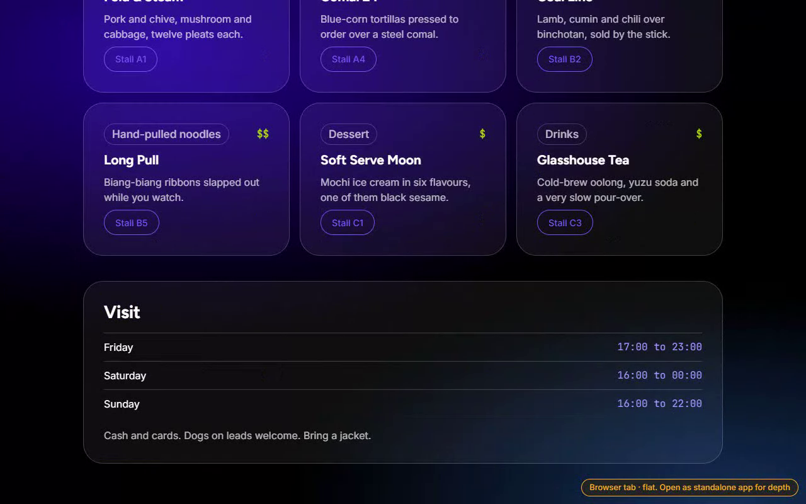
*desktop Chrome*

> **Speaker notes:** If Claude says "the translucent cards are working", ask for the emulator screenshot path and proof the page ran in the runtime (a UA containing WebSpatial/).

## Ask PICO, not the model's memory {#L5-s5}

*id: L5-s5 · level: 5 · step: 5 · kind: step*

**Do this:** Audit your scenes against PICO's own design guidance, with citations.

Claude Code prompt:

```text
Use the pico-dev-knowledge MCP to find what PICO recommends for window sizes and text legibility in spatial apps, cite the source file for each rule, then audit my scenes against it.
```

You should see:

```text
Rules with a source file each, then a list of your scenes that pass or fail them.
```

## Profile it {#L5-s6}

*id: L5-s6 · level: 5 · step: 6 · kind: step*

**Do this:** Find the process, then record and analyze a trace.

Confirm which package your page runs in first. On the emulator the PICO Browser is `com.picoxr.browser`.

```bash
pico-cli app list
```

Claude Code prompt:

```text
Record a 10 second perf trace while the volume scene is open, run the built-in analysis, and tell me the top three costs and one change for each. Say which of them are the browser's cost and which are mine.
```

You should see:

```text
Three costs, each with one change, split into the browser's and yours. Usual suspects: too many enable-xr elements, a heavy GLB, a style loop that runs every frame.
```

> **Speaker notes:** Run `pico-cli perf doctor` once to install the profiler deps. The trace command under the hood is `pico-cli perf trace record -t 10 --package <pkg> -o trace.perfetto-trace`. Unverified: whether a standalone Web App runs under the browser's package or its own.

## Ship it {#L5-s7}

*id: L5-s7 · level: 5 · step: 7 · kind: step*

**Do this:** Deploy over HTTPS and launch it as a Web App from its manifest.

On PICO OS 6 the HTTPS URL is the distribution. No packaging.

```bash
pico-cli web launch --manifest-url https://your.site/app.webmanifest
```

You should see:

```text
Your site opens as a Web App. The manifest needs name or short_name, start_url and icons.
```

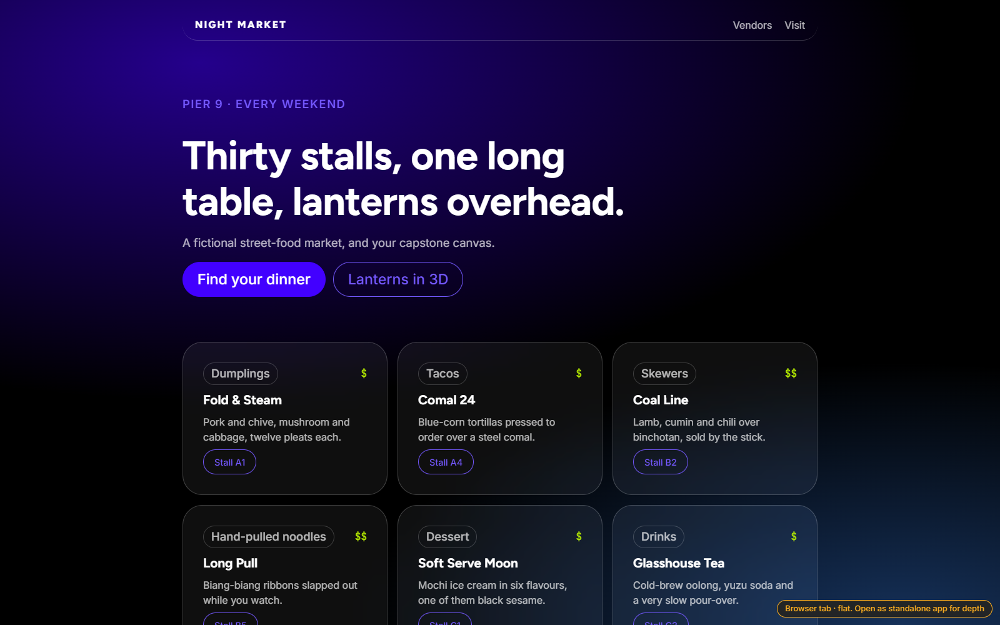
*desktop Chrome*

> **Speaker notes:** Emulator, or a device you own: web launch installs a browser APK first. visionOS is the only target that needs packaging (@webspatial/builder on a Mac). PICO store listing for Web Apps goes through business partnerships.

## Checkpoint: expert {#L5-s8}

*id: L5-s8 · level: 5 · step: 8 · kind: checkpoint*

Tick these honestly.

- Claude Code ran a full loop and every claim came with evidence you opened.
- You got a PICO answer with a cited source from the knowledge MCP.
- You recorded a trace and can name the top cost.
- You can say which claims are proven on the emulator and which would need real PICO OS 6 hardware.

## Capstone: spatialize your own site {#L5-s9}

*id: L5-s9 · level: 5 · step: 9 · kind: lab*

Your site, end to end, with evidence.

1. **React + wiring (L1):** Vite + React, `<SpatialBoot>`, manifest.
2. **Lift (L2):** at most six elements, on glass.
3. **A second window (L4)** and **one volume (L3)**, with a flat fallback.
4. **Evidence:** before/after shots and a 30 s recording.

Claude Code prompt:

```text
Here is my site: <url or repo>. Plan how to spatialize it with WebSpatial in four steps (enable-xr pass, materials and depth, one extra scene, one volume), then do step one and show me a screenshot.
```


*PICO OS 6 emulator, shown with PICO's clearance for this workshop*

> **Speaker notes:** Known issue, cause found: the "Lanterns in 3D" volume opened empty because its <Reality> was 0 px tall (height 100% of an auto-height #root). The fix is 100vw / 100vh; the emulator re-test is pending, so demo the stall window if the lanterns are still empty. An empty volume usually means a 0-px container: size <Reality> in real units. The screenshot is the p5 solution passing in the emulator; in it, opening a stall opens a second spatial window (WALKTHROUGH section 5). Evidence also includes a desktop screenshot; record with pico-cli capture record -t 30. Rubric and submission live in labs/p5-capstone/README.md. The capstone goes home; the room only does the kickoff.

## You're an expert when you can... {#close-s1}

*id: close-s1 · level: close · step: 1 · kind: concept*

Take the list home and tick it honestly.

- Explain in two sentences why WebSpatial is not WebXR.
- Ship a spatial version of any React site whose desktop build is unchanged.
- Say which `--xr-*` property applies to which element, and in what unit.
- Put a GLB in a volume with a poster, an error path and a flat fallback.
- Build a multi-scene app whose state survives any scene closing.
- Hand Claude Code a spec and catch it when its evidence doesn't support its claim.

> **Speaker notes:** Abridged from the SYLLABUS "You're an expert when you can..." list. The full list has eleven items.

## Troubleshooting: "it looks flat" {#close-s2}

*id: close-s2 · level: close · step: 2 · kind: concept*

| Symptom | Check / fix |
|---|---|
| Flat in a browser tab | A tab is **never** spatial. Install it: the monitor icon, titled Install app on OS 6.0.0 (PICO's docs call it Open as standalone app), just left of the star → Install |
| Installed, still flat | **Wait up to 60 s**; if the panels are still missing, close and reopen the app once |
| Second window blank | The page is wrapped in `enable-xr`; remove it |
| Some panels render, others don't | An `enable-xr` nested inside another `enable-xr`: it never renders on PICO OS 6.0.0. Un-nest |
| No install offered at `10.0.2.2` | 10.0.2.2 loads but was not a secure context in our test (no install); use localhost. `node setup/launch.mjs <n>` opens localhost for you |
| No install offered at localhost | Manifest missing, unlinked, or lacking `name` / `start_url` / `icons` / `display` |
| Changed the manifest, nothing changed | The installed app keeps the old one: uninstall (`adb uninstall <pkg>`) and install again |
| Volume or window opens flat at 1280×720 | `initScene` ran before boot finished, so it did nothing. Register scenes in `<SpatialBoot onReady>` |
| Installed, UA has `WebSpatial/`, still inert | App not wrapped in `<SpatialBoot>`: in 2.0 spatial code loads only inside it |
| Still inert with `<SpatialBoot>` | `jsxImportSource` missing in the tsconfig **or** in `react({ jsxImportSource })` in `vite.config.ts` |
| One element won't lift | No `enable-xr`, or no `position: relative / absolute / fixed` |
| Glass looks solid | Your own `background` covers the material; clear it in spatial mode |

> **Speaker notes:** Root cause and first five rows: labs/SPATIAL-CRACK.md (VERIFIED on the OS 6.0.0 emulator, 2026-09-24): only an installed Web App's UA contains WebSpatial/, and the SDK checks for exactly that. Other rows: curriculum/TROUBLESHOOTING.md.

## Troubleshooting: setup and the emulator {#close-s3}

*id: close-s3 · level: close · step: 3 · kind: concept*

| Symptom | Check / fix |
|---|---|
| PICO Spatial plugin won't install | Android Studio must be **2025.1.x**, not the latest |
| Emulator dies: `QEMU main loop exits abnormally` | Not enough free RAM; the real message is on **stderr**. Use the 16 GB recipe |
| "Site can't be reached" at `localhost:<port>` | Dev server not running, or the `adb reverse` mapping is gone (it resets when the emulator restarts): rerun `node setup/launch.mjs <n>` |
| Still unreachable | Wrong port, or the firewall blocks Node on private networks |
| Knowledge MCP stopped answering | `pico-cli setup` ran while sessions were open; restart Claude Code |
| Install fails, logcat says `manifest is empty` | Manifest icons rejected (seen with one SVG icon): ship PNG icons with real `sizes` (192, 512, 1024 + maskable) |
| One screenshot is mostly black | Capture artefact, not your page: use `node setup/snap.mjs` (burst) |
| HUD misses a message sent as it opened | Chrome drops a BroadcastChannel post made in the same task as `window.open`: post, then `setTimeout(() => window.open(url, name), 100)` |

> **Speaker notes:** Rows from curriculum/TROUBLESHOOTING.md "Setup and emulator" and "Reaching the dev server", plus the kit CLAUDE.md screenshot rule.

## PICO Early Access Developer Program {#close-s4}

*id: close-s4 · level: close · step: 4 · kind: concept*

Where tonight's build can go next. Quoted exactly from his slide:

> PICO EARLY ACCESS DEVELOPER PROGRAM
> Invitees get up to $1500 for publishing their AI generated application
> October 1-Nov 11 2026
> Hardware Access

[Open slide 12 in David Oh's deck](../partner/pico-cli-quickstart-david-oh/index.html#12)

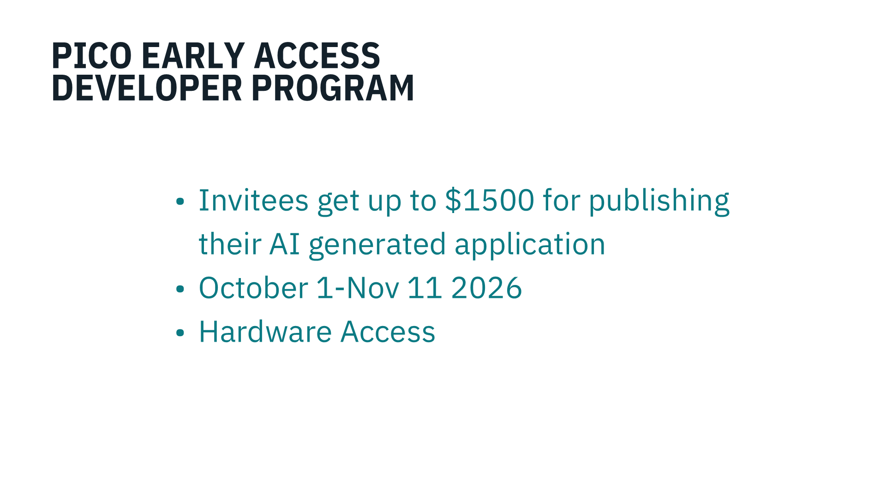

> **Speaker notes:** Quote copied from partner/pico-cli-quickstart-david-oh/slides.md, "Slide 12", which is the verbatim text of the unmodified .pptx. Eligibility, how to get invited and the terms are PICO's to answer; point questions to David.

## Official examples {#close-s5}

*id: close-s5 · level: close · step: 5 · kind: concept*

One SDK 2.0 example runs in the kit. The rest are linked, mostly SDK 1.x.

```bash
cd examples/webspatial-vite-min
```

```bash
npm run dev:xr   # port 5501
```

```bash
node setup/launch.mjs --url http://localhost:5501/   # 2nd terminal
```

| Linked | Level | SDK |
|---|---|---|
| sample-techshop, WebSpatialPlayground | L2 to L4 | 1.x |
| sample-solarsystem, widget-generator | L3, L4 | 1.x |
| webspatial-sdk `apps/*` (Next, Remix, Rspack) | L5 | **2.0** |


*desktop Chrome*

> **Speaker notes:** Run the launch command from the kit root in a second terminal, then install the example as a Web App. Source: examples/README.md (examples-scout). Every standalone sample repo is SDK 1.x with @webspatial/vite-plugin, which fails to build on 2.0; only the apps/* fixtures in the webspatial-sdk monorepo are 2.0. @webspatial/starter 0.1.0 scaffolds ^1.5.0. The labs win where these disagree. webspatial-vite-min is desktop-verified (build clean, 0 console errors on all 3 pages, __webspatialsdk__ 2.0.0) and not yet run on the emulator; its Model swaps in the p3 avocado GLB on PICO. It shares labs/node_modules, so run npm run labs:install first. Repos without a license are linked, not vendored. Community apps: webspatial.dev/showcase.

## Resources: everything in the kit {#close-s6}

*id: close-s6 · level: close · step: 6 · kind: concept*

One place for all of it. Every link is relative to this deck.

- **The kit:** [github.com/RayyanZahid/pico-workshops](https://github.com/RayyanZahid/pico-workshops) (this Academy is in `webspatial-academy/`)
- **This deck:** [slides.md](slides.md) · [deck.json](deck.json) · [llms.txt](llms.txt)
- **Start here:** [setup/SETUP.md](../setup/SETUP.md) · [setup/DEPENDENCIES.md](../setup/DEPENDENCIES.md) · [CLAUDE.md](../CLAUDE.md) (what Claude Code follows in this kit)
- **Curriculum:** [SYLLABUS](../curriculum/SYLLABUS.md) · [L0](../curriculum/L0.md) · [L1](../curriculum/L1.md) · [L2](../curriculum/L2.md) · [L3](../curriculum/L3.md) · [L4](../curriculum/L4.md) · [L5](../curriculum/L5.md) · [GLOSSARY](../curriculum/GLOSSARY.md) · [TROUBLESHOOTING](../curriculum/TROUBLESHOOTING.md) · [outline.json](../curriculum/outline.json)
- **Labs:** [p1 hello spatial](../labs/p1-hello-spatial/README.md) · [p2 spatialize a site](../labs/p2-spatialize-site/README.md) · [p3 volume model](../labs/p3-volume-model/README.md) · [p4 Space Invaders](../labs/p4-space-invaders/README.md) · [p5 capstone](../labs/p5-capstone/README.md)
- **From PICO:** [PICO CLI Quickstart, David Oh](../partner/pico-cli-quickstart-david-oh/index.html) · [README](../partner/pico-cli-quickstart-david-oh/README.md) · [slides.md](../partner/pico-cli-quickstart-david-oh/slides.md) (native Spatial SDK path; shown as sent)
- **Versions:** [labs/VERSIONS.md](../labs/VERSIONS.md) (SDK 2.0.0 pins, why there's no vite-plugin)
- **Official examples:** [examples/README.md](../examples/README.md) · [webspatial-vite-min](../examples/webspatial-vite-min/UPSTREAM-README.md) (runs in the kit, SDK 2.0) · [webspatial-sdk apps](https://github.com/webspatial/webspatial-sdk/tree/main/apps) · [showcase](https://webspatial.dev/showcase)
- **Emulator notes:** [labs/EMULATOR-RESULTS.md](../labs/EMULATOR-RESULTS.md) · [labs/SPATIAL-CRACK.md](../labs/SPATIAL-CRACK.md)
- **Sources (PICO docs):** [WebSpatial on PICO](https://developer.picoxr.com/document/web/webspatial/) · [Manifest](https://developer.picoxr.com/document/web/manifest/) · [Install-free Web Apps](https://developer.picoxr.com/document/web/install-free/) · [assets/pico-docs/WEB-APP-RUNTIME.md](../assets/pico-docs/WEB-APP-RUNTIME.md)
- **Outside the kit:** [webspatial.dev](https://webspatial.dev) · [developer.picoxr.com](https://developer.picoxr.com) · `pico-cli <family> --help` (commands checked against pico-cli 0.5.0)

> **Speaker notes:** The emulator and PICO WebSpatial browser are PICO-licensed; PICO cleared this workshop's attendees. The kit will move under a hub folder alongside the Vibe XR kit; all links here are relative so the move keeps them working.
