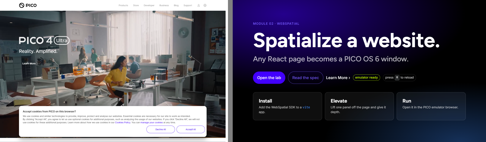

# theme/

The PICO brand as it appears on https://www.picoxr.com/global. I fetched the page on 2026-09-24, along with its 7 stylesheets on `lf16-statics.picovr.com`, and read the computed styles in headless Chrome.

- `pico.css`: tokens, a slide type scale, and the classes `.pico-btn` `.pico-btn--ghost` `.pico-link` `.pico-panel` `.pico-chip` `.pico-kbd` `.pico-display` `.pico-eyebrow`.
- `pico-theme.js`: the `PICO` hex map, `applyPicoFog(scene, THREE, {ar})` and `picoMaterial(THREE, 'glass'|'glow'|'matte', opts)`. It has the same API as `projects/pico-vibe-xr/theme/pico-theme.js`.
- `sample-slide.html`: one slide built only from these tokens. Screenshots are in `screens/`.

## What the site looks like

The chrome is light: a white nav, `#f7f8fa` panels, 16px-radius cards and a cookie sheet with outline pills. Inside that chrome, the product imagery is dark and full-bleed: a black hero video, violet and neon game art, and a near-black footer. One electric violet, `#4200ff`, carries every call to action, and it is always a pill. Headlines use PICO Sans at 700. UI copy uses Inter at 400 or 500. The site has no decorative gradients. Its only gradients are a black overlay that darkens the violet button on hover and press, and edge scrims over imagery.

The theme ships both registers:

- `:root` / `[data-theme="dark"]` is the default. It matches the hero, the cards and the footer, and it suits projected slides and headsets.
- `[data-theme="light"]` matches the site chrome.

Left: the picoxr.com hero (live video frame, cookie sheet showing the outline pills). Right: `sample-slide.html` in dark. The light treatment is in `screens/sample-slide-light.png`.

## Fonts

| Role | Font | Source |
|---|---|---|
| Display | **Figtree** | DERIVED. The site's headline face is `PICO Regular` = `PICO-Sans-VFS.ttf`, which PICO licenses for its own platform. We do not hotlink it. I rendered PICO Sans next to Inter, Manrope, Plus Jakarta Sans, Figtree, Outfit, Urbanist and Lexend at 40px. Figtree matches best: it has the same round geometric O and two-storey a. PICO Sans runs about 3% wider. |
| Body | **Inter** | SOURCE. It is the `body` font-family on the site, and it is OFL. |
| Mono | JetBrains Mono | DERIVED. The site stack is Monaco and Menlo, which Windows lacks. |

## Tokens

The selectors below are PICO's CSS-module classes with the hash suffix trimmed. For example, `.button-container` appears on the site as `.button-container-OiQcll`.

| Token | Dark (default) | Light | Source |
|---|---|---|---|
| `--pico-bg` | `#000000` | `#ffffff` | SOURCE. `#000` in main.css, `.footer-container` rgba(0,0,0,.92), and the page white |
| `--pico-surface` | `rgba(255,255,255,.06)` | `#f7f8fa` | dark: DERIVED glass tier. light: SOURCE `.wrapper`, `.list`, `.video-container` |
| `--pico-surface-2` | `#232526` | `#f2f3f5` | SOURCE `.media-modal-container` / `.menu-user` rule |
| `--pico-ink` | `#ffffff` | `rgba(0,0,0,.92)` | SOURCE. Hero title computed, and `.learn-more` |
| `--pico-ink-dim` | `rgba(255,255,255,.70)` | `rgba(0,0,0,.70)` | SOURCE. Card `.desc` and cookie `.desc`, computed |
| `--pico-ink-faint` (extra) | `rgba(255,255,255,.40)` | `#999999` | SOURCE. Footer `.card-area .item` and nav items |
| `--pico-accent` | `#7458ff` | `#4200ff` | dark: DERIVED. Raw `#4200ff` is 2.6:1 as text on black. `#7458ff` is 4.6:1 on black, and white on it is also 4.6:1, so it works as text and as a fill. light: SOURCE `.button-container` |
| `--pico-accent-fill` (extra) | `#4200ff` | `#4200ff` | SOURCE `.button-container` background. White text on it is 7.9:1. **Use this for button fills.** |
| `--pico-accent-2` | `#3d8bff` | `#3f00f2` | SOURCE. `.switch-button:checked+label` / `.btn-container` border |
| `--pico-glow` | `#a393ff` | `#3d8bff` | dark: DERIVED light violet tint for rims and focus. light: SOURCE switch blue |
| `--pico-danger` | `#ff4d4f` | `#ff4d4f` | SOURCE `.field-error` |
| `--pico-ok` | `#b8f000` | `#1f9d55` | DERIVED. The dark value is the Motion Tracker strap lime from the product shot. The site has no success colour. |
| `--pico-warn` | `#ffb020` | `#b86e00` | DERIVED. The site has no warning colour. |
| `--pico-rule` | `rgba(255,255,255,.20)` | `rgba(0,0,0,.12)` | SOURCE. `.side-line` hsla(0,0%,100%,.2) / the most frequent rgba in main.css |
| `--pico-grad-hover` / `--pico-grad-press` | 12% / 24% black over `#4200ff` | same | SOURCE `.button-container:hover` / `:active` |
| `--pico-grad-hero` | violet and blue radial glow on black | `#f7f8fa` to white | DERIVED. A stand-in for the hero video |
| `--pico-font-display` / `-body` / `-mono` | Figtree / Inter / JetBrains Mono | | see Fonts |
| `--pico-radius` | `16px` | | SOURCE. `.wrapper` and `.video-container`, the most-used radius |
| `--pico-radius-lg` | `32px` | | PICO-SDK. The window corner radius is 32 dp |
| `--pico-radius-pill` (extra) | `100px` | | SOURCE `.button-container` |
| `--pico-target` | `56px` | | PICO-SDK. The hotspot is 56 x 56 dp. Also SOURCE `.triggerButton` |
| `--pico-btn-h` (extra) | `48px` | | SOURCE `.btn-container` height |
| `--pico-pad` / `--pico-gap` | `32px` / `16px` | | PICO-SDK Padding Large / Regular. `16px` is also SOURCE `.wrapper` padding |
| `--pico-step--1` to `--pico-step-5` | clamp ramps, 14px to 128px at 1920 wide | | DERIVED from the site ramp: SOURCE computed 14 / 16 / 18 / 30 / 32 / 44px, scaled up for a room |

Counts for the 20 required tokens, per treatment (dark / light):

- dark: 9 SOURCE, 7 DERIVED, 4 PICO-SDK.
- light: 12 SOURCE, 4 DERIVED, 4 PICO-SDK.

The DERIVED tokens are the display and mono fonts, the success and warning colours the site does not have, and, in dark only, the glass surface, the violet lifted for text, and the glow.

## Rules of use

- There is one violet per slide, and it goes on the thing to do. Buttons use `--pico-accent-fill`. Text and outlines use `--pico-accent`.
- Every CTA is a pill (`.pico-btn`, `.pico-btn--ghost`), or it is a `.pico-link` that reads "Learn More ›", the site's most common CTA.
- Put imagery on dark and chrome on light. Do not put flat gradients behind text when a real screenshot or photo is available.
- In `immersive-ar`, call `applyPicoFog(scene, THREE, { ar: true })`. It clears the background and fog so the room shows through.
